# Battery Cell Tracker - Architecture Document

**Version:** 2.0
**Last Updated:** 2026-03-28
**Status:** Draft

---

## 1. Architectural Philosophy

### 1.1 Zero-Backend Architecture

The Battery Cell Tracker is a **fully client-side application**. There is no application server, no database server, no backend API, and no intermediary service of any kind.

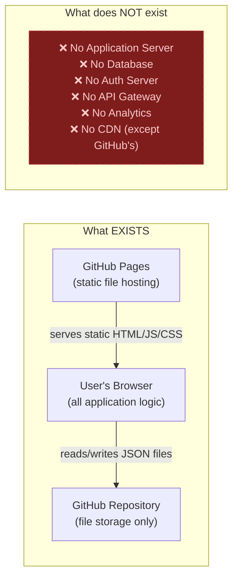

**Key implications:**
- The application is a set of static files (HTML, JS, CSS) served by GitHub Pages
- All computation happens in the user's browser
- GitHub is used purely as a key-value store (file path → JSON content)
- The GitHub PAT (Personal Access Token) is stored **only** in the user's browser, encrypted
- No user data ever passes through any server we control

### 1.2 Why Zero-Backend?

| Concern | How It's Solved |
|---------|----------------|
| Hosting cost | Free (GitHub Pages) |
| Server maintenance | None needed |
| Scalability | Each user has their own GitHub repo |
| Privacy | Data only exists in user's browser + their own GitHub repo |
| Authentication | GitHub PAT (user manages their own token) |
| Availability | GitHub's 99.9% uptime SLA |
| Vendor lock-in | Data is plain JSON in a Git repo the user owns |

### 1.3 Trust Boundaries

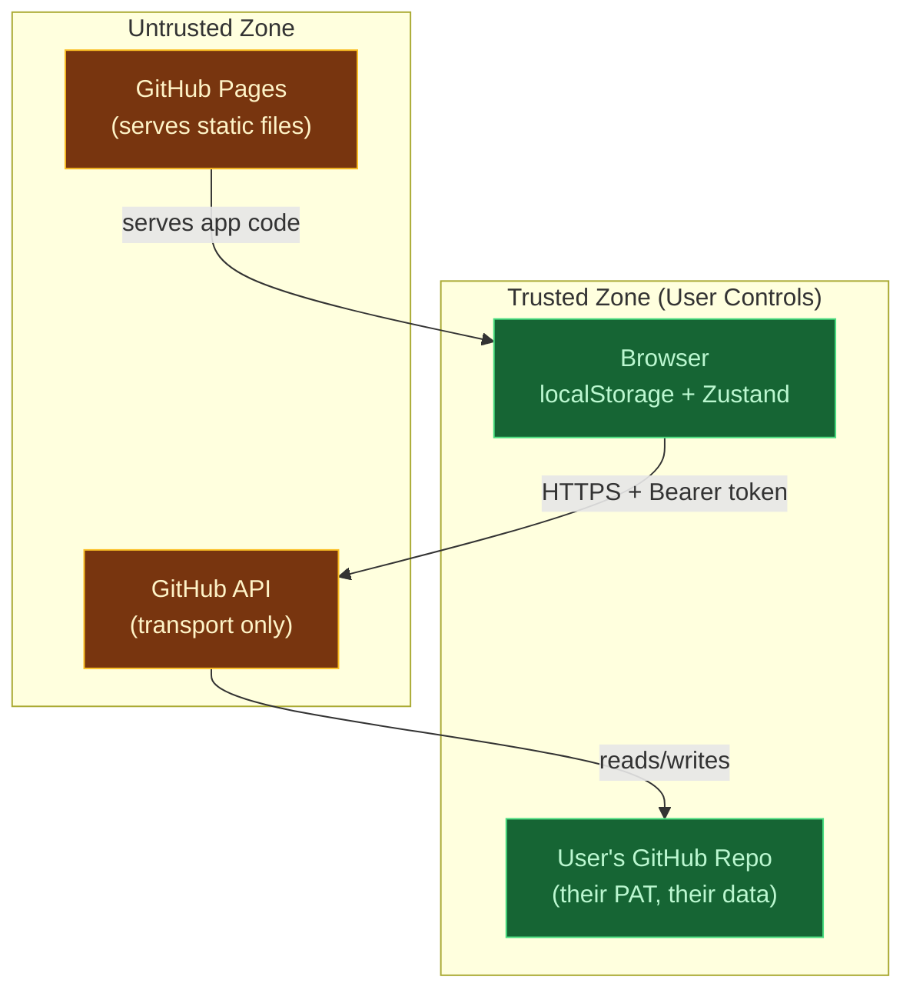

**What we trust:**
- The user's browser (executes our code, stores encrypted PAT)
- The user's GitHub repository (stores their data)

**What we don't control:**
- GitHub API (transport layer - we use HTTPS)
- GitHub Pages (serves our static files - no secrets involved)

---

## 2. System Context

### 2.1 Context Diagram

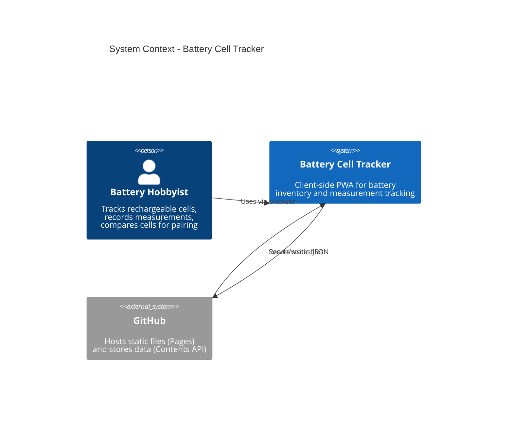

### 2.2 Multi-Device Context

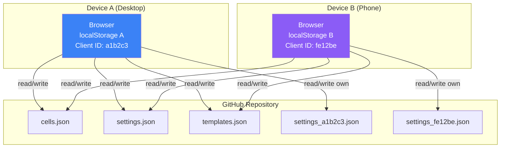

Each device:
- Reads/writes the **shared** data files (cells, settings, templates) using three-way merge
- Reads/writes **only its own** client settings file (no merge needed)
- Has its own localStorage with independent base snapshots and encrypted PAT

---

## 3. Application Architecture

### 3.1 Layer Diagram

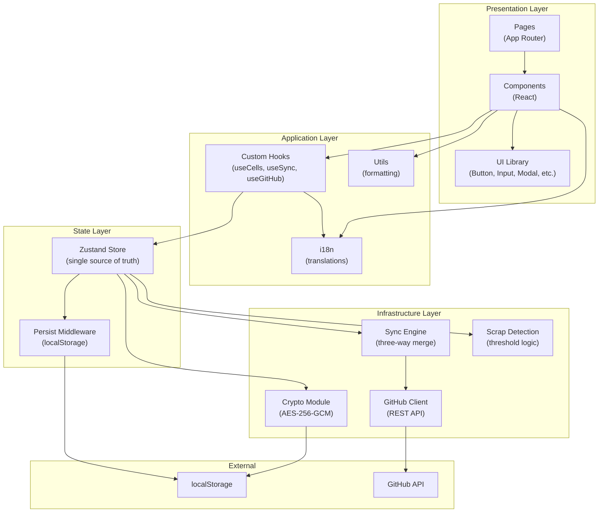

### 3.2 Layer Responsibilities

| Layer | Responsibility | May Depend On |
|-------|---------------|---------------|
| **Presentation** | Render UI, handle user input, display data | Application, State |
| **Application** | Business hooks, translations, formatting | State |
| **State** | Single source of truth, CRUD operations, persistence | Infrastructure |
| **Infrastructure** | GitHub API calls, encryption, sync algorithm, scrap detection | External systems |

**Dependency rule:** Layers may only depend on layers below them. The Presentation layer never directly calls GitHub API or accesses localStorage.

### 3.3 Module Dependency Graph

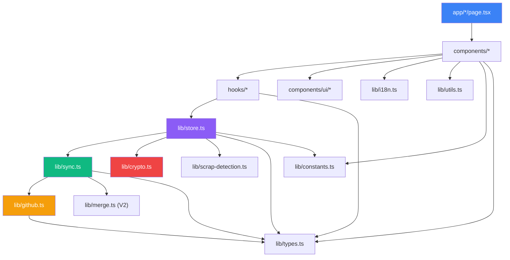

---

## 4. Data Architecture

### 4.1 Data Flow Overview

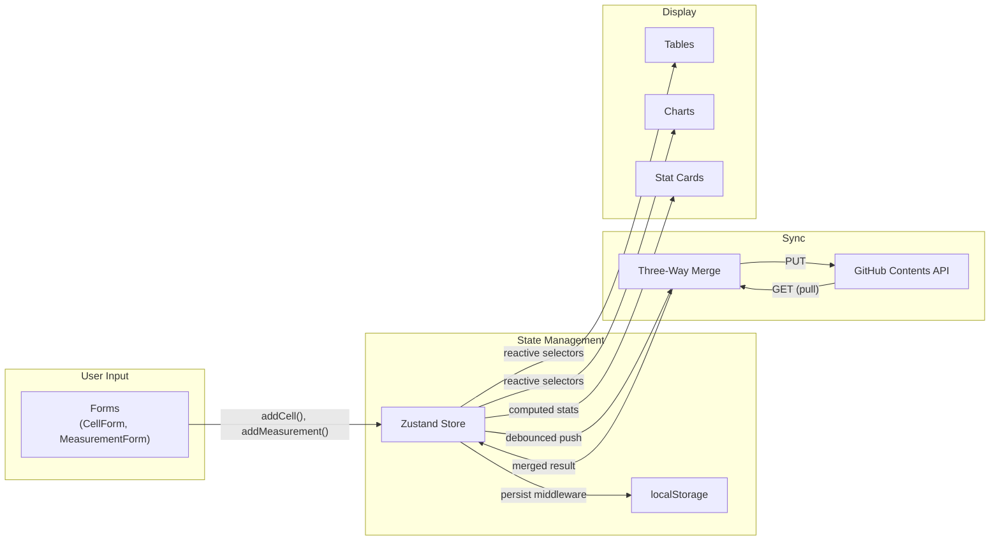

### 4.2 Storage Architecture

**No data is stored on any server we control.** All data resides in exactly two locations:

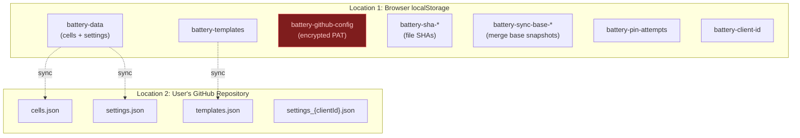

**What is NOT stored anywhere:**
- User's PIN (only used transiently to derive encryption key)
- Plaintext GitHub PAT (always encrypted at rest)
- Usage analytics or telemetry
- Server-side sessions or cookies
- Any data on our infrastructure

### 4.3 Data Ownership

| Data | Owner | Location | Encrypted |
|------|-------|----------|-----------|
| Cell inventory | User | localStorage + their GitHub repo | No |
| Settings | User | localStorage + their GitHub repo | No |
| Templates | User | localStorage + their GitHub repo | No |
| GitHub PAT | User | localStorage only | Yes (AES-256-GCM) |
| PIN | User | User's memory only | N/A (never stored) |
| App source code | Project | GitHub Pages (public) | No |

---

## 5. Security Architecture

### 5.1 Threat Model

| Threat | Mitigation |
|--------|-----------|
| PAT theft from localStorage | AES-256-GCM encryption with PBKDF2-derived key |
| Brute-force PIN attack | Progressive lockout delays, config wipe after 10 attempts |
| Session hijacking | Auto-lock after 30 minutes inactivity |
| Man-in-the-middle | HTTPS for all GitHub API calls |
| XSS | React's built-in escaping, no `dangerouslySetInnerHTML` |
| Malicious app update | User can verify source code (open source) |
| Data loss | Three-way merge prevents overwrites; export/import for backup |
| Remote data corruption | No force push; remote always protected |

### 5.2 Encryption Flow

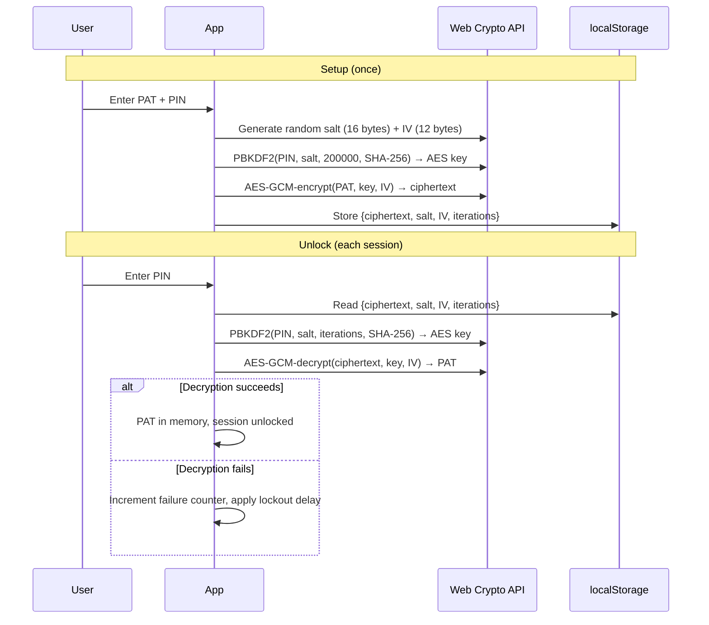

### 5.3 Session Lifecycle

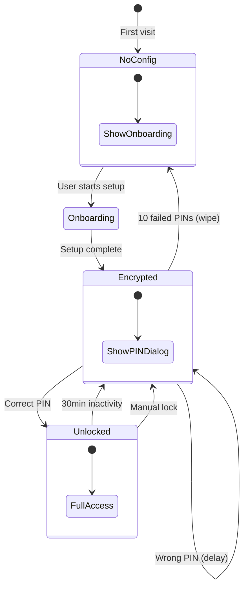

---

## 6. Sync Architecture

### 6.1 Sync Overview

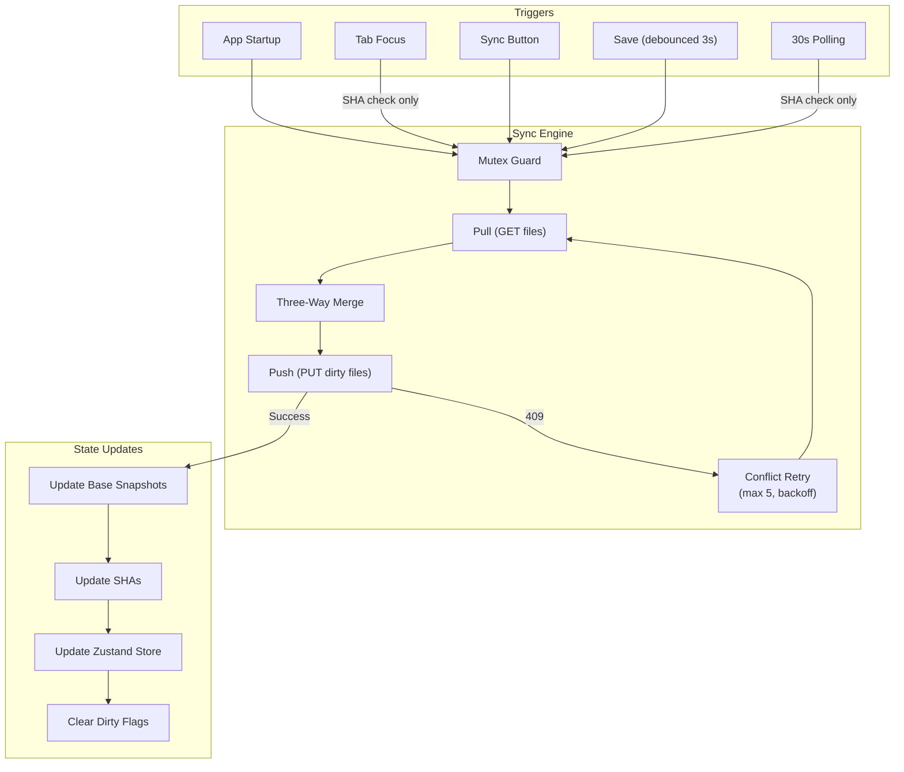

### 6.2 Merge Architecture

Detailed merge algorithm specified in [Git Sync & Merge Specification](git-sync-merge-specification.md).

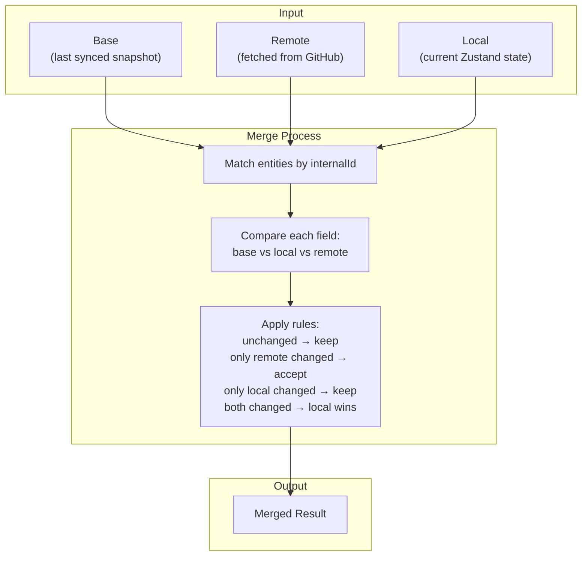

---

## 7. Component Architecture

### 7.1 Page-Component Mapping

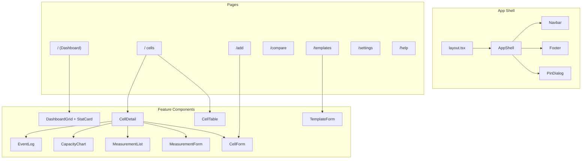

### 7.2 State Flow in Components

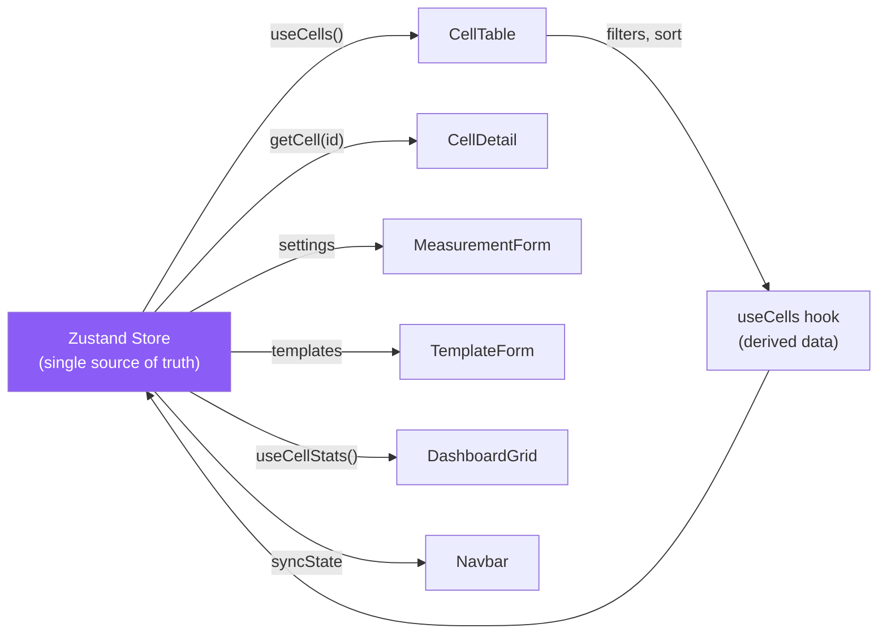

All components read from the Zustand store via hooks. Components never fetch data directly from localStorage or GitHub. The store is the single source of truth.

---

## 8. Deployment Architecture

### 8.1 Build & Deploy Pipeline

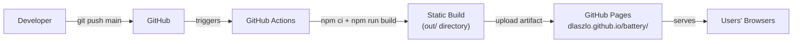

### 8.2 Infrastructure

| Component | Service | Cost |
|-----------|---------|------|
| Static hosting | GitHub Pages | Free |
| Data storage | GitHub repository (user's own) | Free |
| CI/CD | GitHub Actions | Free (public repo) |
| CDN | GitHub Pages built-in | Free |
| SSL/TLS | GitHub Pages (automatic) | Free |
| Domain | github.io subdomain | Free |

**Total infrastructure cost: $0/month**

### 8.3 Build Artifacts

```
out/                               # Static export output
├── index.html                     # Dashboard page
├── cells/index.html               # Cells page
├── add/index.html                 # Add cell page
├── compare/index.html             # Compare page
├── templates/index.html           # Templates page
├── settings/index.html            # Settings page
├── help/index.html                # Help page
├── _next/                         # JS/CSS bundles
├── manifest.json                  # PWA manifest
├── sw.js                          # Service Worker
├── icon-192.png                   # PWA icon
└── icon-512.png                   # PWA icon
```

---

## 9. PWA Architecture

### 9.1 Service Worker Strategy

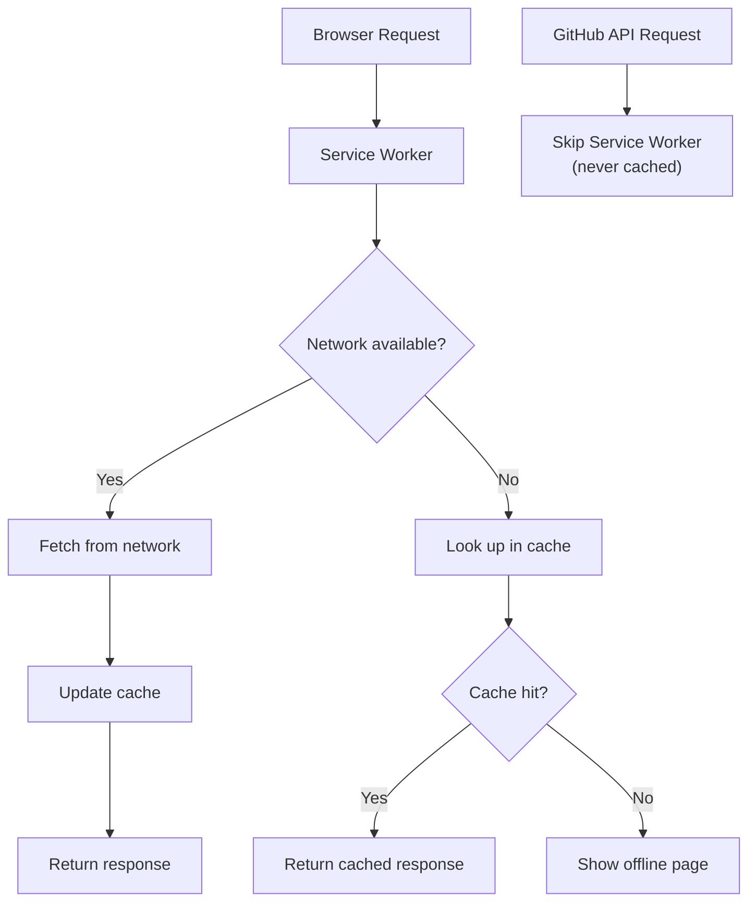

**Strategy:** Network-first with cache fallback.
- App shell and assets are cached for fast loading
- GitHub API calls are **never cached** by the Service Worker
- Navigation requests fall back to cached index.html when offline

### 9.2 Installation

The app is installable as a PWA on:
- **Android:** Chrome "Add to Home Screen"
- **iOS:** Safari "Add to Home Screen"
- **Desktop:** Chrome/Edge "Install app"

---

## 10. Error Handling Architecture

### 10.1 Error Propagation

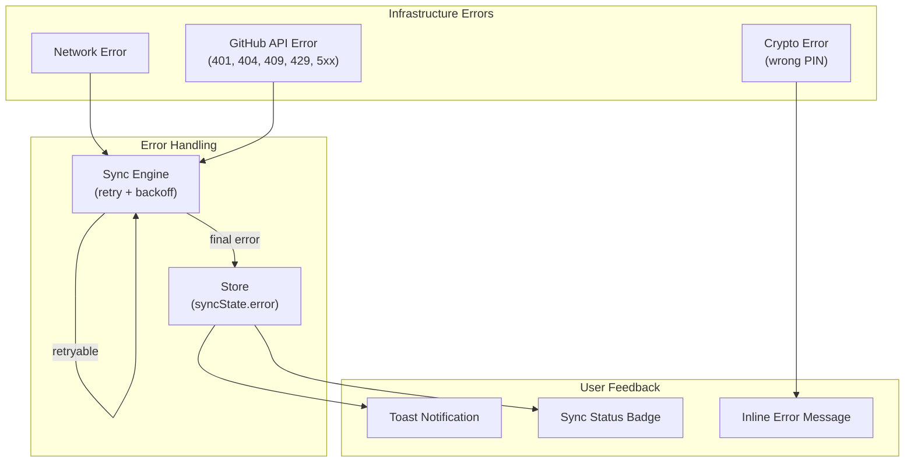

### 10.2 Error Categories

| Category | Examples | Handling |
|----------|---------|---------|
| Validation | Missing required field, invalid format | Inline field error, block submit |
| Transient | Network timeout, 5xx, 409 conflict | Retry with backoff |
| Auth | 401/403, expired token | Show re-auth prompt |
| Client | Wrong PIN, corrupted data | Error message, recovery options |
| Rate limit | 429 | Show message, wait for reset |

---

## 11. Cross-Cutting Concerns

### 11.1 Internationalization

```
User selects language (client setting)
        │
        ▼
t("key", language) ──► Translation map ──► Localized string
        │
        ▼
Component renders localized text
```

- Two languages: Hungarian (hu), English (en)
- 200+ translation keys
- Template interpolation: `t("key", lang, { count: "5" })`
- Language stored in per-device client settings

### 11.2 Theming

```
User selects theme (client setting)
        │
        ▼
ThemeProvider ──► Applies class to <html>
        │          "light" | "dark" | based on prefers-color-scheme
        ▼
Tailwind dark: variants activate
```

### 11.3 Responsive Design

| Breakpoint | Width | Layout Adjustments |
|-----------|-------|-------------------|
| Default | < 640px | Single column, hidden table columns, hamburger nav |
| SM | 640px+ | Two-column forms |
| MD | 768px+ | More table columns visible |
| LG | 1024px+ | Three-column grids, full table |
| XL | 1280px+ | All table columns visible |

---

## 12. Decision Records

### DR-01: Static Export over Server-Side Rendering

**Decision:** Use `output: "export"` for static HTML generation.
**Reason:** Enables free hosting on GitHub Pages. No server infrastructure to maintain. All data comes from localStorage/GitHub API, so SSR provides no benefit.
**Trade-off:** No dynamic routes (use query params instead), no API routes, no server-side data fetching.

### DR-02: GitHub Contents API over Git Data API

**Decision:** Use the Contents API (`/repos/{owner}/{repo}/contents/{path}`) for file operations.
**Reason:** Simpler to use, no need to manage Git trees/blobs/commits manually. Built-in optimistic concurrency via SHA.
**Trade-off:** One commit per file (no atomic multi-file commits). Max 1 MB per file via REST. The three-way merge algorithm compensates for the non-atomic limitation.

### DR-03: Zustand over Redux/Context

**Decision:** Use Zustand for state management.
**Reason:** Minimal boilerplate, built-in persist middleware for localStorage, works well with React 19. Simple API for a single-store application.
**Trade-off:** Less ecosystem tooling than Redux, but the app's complexity doesn't warrant Redux.

### DR-04: localStorage over IndexedDB

**Decision:** Use localStorage for all client-side persistence.
**Reason:** Simpler API, synchronous access, sufficient for the data sizes involved (< 5 MB). Zustand's persist middleware has built-in localStorage support.
**Trade-off:** 5-10 MB storage limit per origin (browser-dependent). For the expected data size (< 2 MB for 500 cells), this is sufficient.

### DR-05: Field-Level Three-Way Merge over Last-Write-Wins

**Decision:** Implement field-level three-way merge with base snapshot tracking.
**Reason:** Prevents data loss when two devices edit different fields of the same cell concurrently. Last-write-wins at the entity level would discard one device's changes entirely.
**Trade-off:** More complex implementation, requires base snapshot storage in localStorage.

### DR-06: Hard Delete over Soft Delete

**Decision:** Use hard delete for cells (remove from array) instead of soft delete (`deletedAt` field).
**Reason:** Three-way merge handles deletion tracking via base comparison (entity in base but not in local = deleted). Soft delete adds complexity and grows the data file indefinitely.
**Trade-off:** Deleted cells cannot be recovered from the JSON file (but Git history preserves them).

### DR-07: No Offline Mode

**Decision:** Require internet connection; disable editing when offline.
**Reason:** Without a backend to mediate conflicts, offline edits that accumulate over extended periods create complex merge scenarios. The risk of data loss or confusion outweighs the convenience of offline editing.
**Trade-off:** Users cannot use the app without internet. An offline banner blocks edits.

### DR-08: Client-Specific Settings Files

**Decision:** Store per-device settings in separate files (`settings_{clientId}.json`).
**Reason:** Theme, language, and temperature unit preferences may differ between devices (phone vs desktop). Merging these settings would cause one device to overwrite the other's preferences.
**Trade-off:** Multiple small settings files in the repository. Stale client settings files may accumulate if a device is no longer used.

### DR-09: 30-Second Polling with Badge Notification

**Decision:** Poll remote SHA every 30 seconds, show badge but don't auto-merge.
**Reason:** Auto-merging during active editing could confuse the user. A badge lets the user decide when to sync. 30 seconds balances freshness with API rate budget.
**Trade-off:** Changes from other devices appear with up to 30-second delay in the badge. Actual data update requires user action or navigation.
