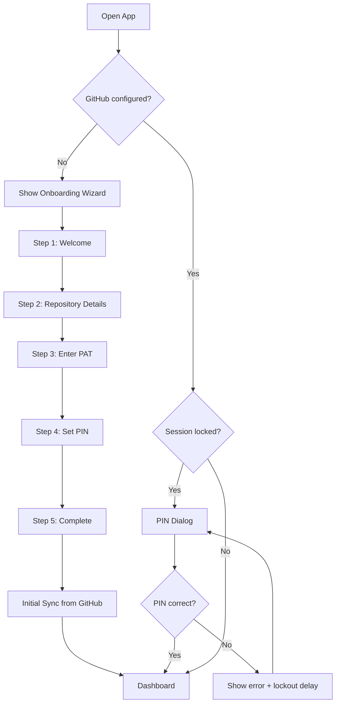
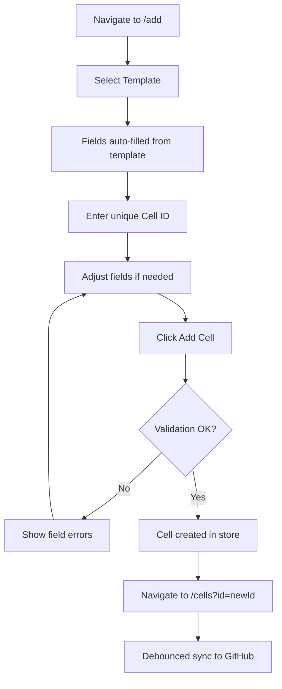
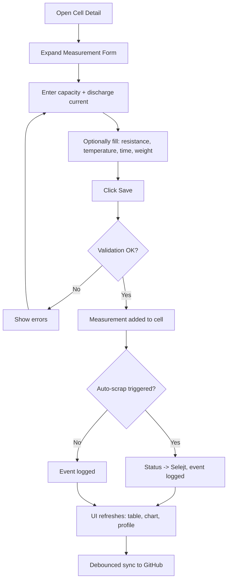
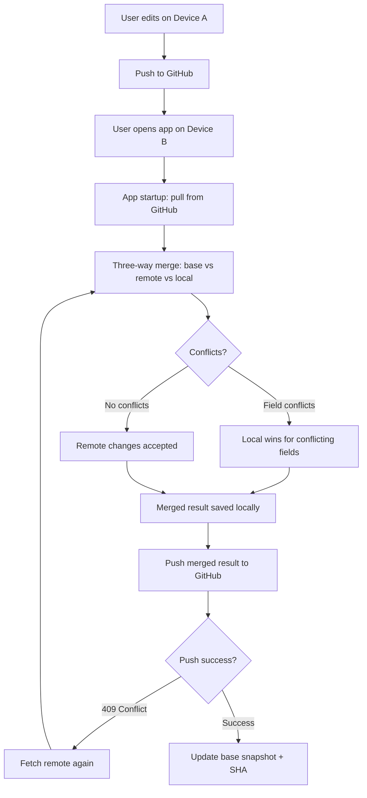
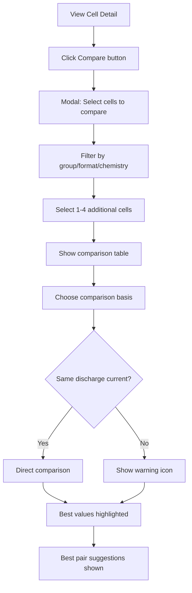
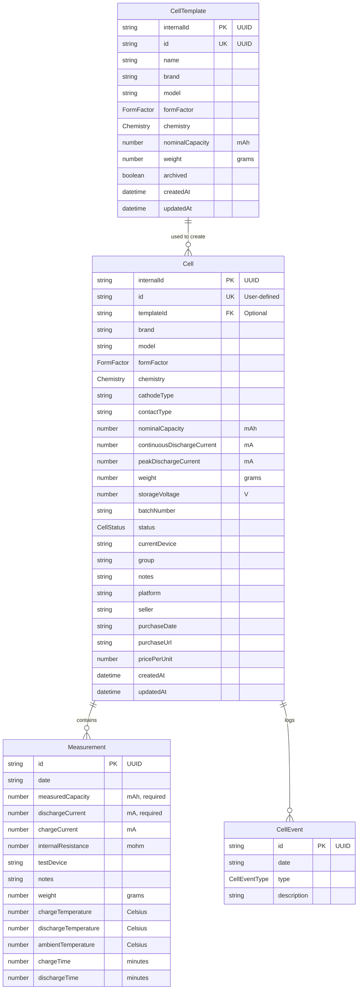
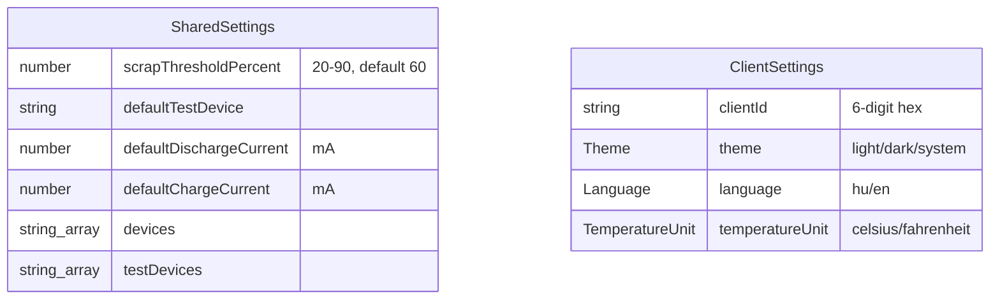

# Battery Cell Tracker - Functional Specification

**Version:** 2.0
**Last Updated:** 2026-03-28
**Status:** Draft

---

## 1. Introduction

### 1.1 Purpose

Battery Cell Tracker is a client-side web application for managing rechargeable battery cell inventories. Users track cell metadata, record capacity measurements over time, detect degraded cells, compare cells for pairing, and synchronize data across devices via GitHub.

### 1.2 Target Users

Battery hobbyists and DIY builders who:
- Collect and test rechargeable cells (18650, 21700, AA, etc.)
- Build battery packs for e-bikes, powerwalls, flashlights
- Need to match cells by capacity for series/parallel configurations
- Use capacity testers (e.g., LiitoKala Lii-700, XTAR VC4SL, Opus BT-C3100)

### 1.3 Key Principles

- **Zero backend** - all data stored locally (localStorage) and optionally synced to a user-owned GitHub repository
- **Privacy first** - no telemetry, no analytics, no third-party data storage
- **Online required** - internet connection required for GitHub sync; app does not support offline mode to prevent data consistency issues
- **Multi-device** - reliable concurrent usage across phone and desktop via three-way merge
- **Multi-language** - Hungarian and English UI

---

## 2. Functional Requirements

### 2.1 Cell Inventory Management

#### FR-01: Create Cell
- User provides a unique alphanumeric ID (e.g., "01", "A1", "BK-042")
- Required fields: ID, brand, nominal capacity, form factor, chemistry, status
- Optional fields: model, cathode type, contact type, weight (g), storage voltage (V), batch number, group, notes
- Optional purchase info: platform, seller, purchase URL, purchase date, price per unit
- Optional placement: current device, group
- Cell can be created from a template (auto-fills specs from template)
- On creation, a UUID `internalId` is generated for sync purposes
- A "created" event is logged automatically

#### FR-02: Edit Cell
- All fields except ID are editable
- Changes to status and device are tracked via events
- An "edited" event is logged on save
- `updatedAt` timestamp is refreshed

#### FR-03: Duplicate Cell
- Creates a new cell with the same properties as an existing cell
- User must provide a new unique ID
- Measurements and events are NOT copied

#### FR-04: Delete Cell
- Hard delete (cell removed from data)
- Confirmation dialog required
- A "deleted" event is created before removal (for sync merge tracking)

#### FR-05: View Cell List
- Tabular view of all cells
- Filterable by: text search (ID, brand, model, group), status, chemistry, form factor
- Sortable by: ID, brand, nominal capacity, status
- Responsive: columns hidden on smaller screens
- Status displayed as colored badge

#### FR-06: View Cell Detail
- Full cell information displayed in categorized grid
- Cell profile card with derived statistics (see FR-20)
- Capacity trend chart (see FR-21)
- Measurement list with add/delete capability
- Event log (chronological history)
- Action buttons: Edit, Duplicate, Scrap, Delete, Compare

#### FR-07: Cell Statuses
| Status | Hungarian | Description |
|--------|-----------|-------------|
| New | Uj | Unopened, untested |
| Used | Hasznalt | In active use |
| Salvaged | Bontott | Removed from device/pack |
| Scrapped | Selejt | Below threshold, unusable |

### 2.2 Measurement Tracking

#### FR-08: Add Measurement
- Required fields: measured capacity (mAh), discharge current (mA)
- Optional fields: date (defaults to today), charge current (mA), internal resistance (mohm), test device, notes, weight (g), charge temperature, discharge temperature, ambient temperature, charge time, discharge time
- Temperature stored in Celsius internally; displayed in user's preferred unit (Celsius or Fahrenheit)
- Time input in `H:MM` format, stored as integer minutes
- Warning shown if discharge current differs from previous measurement
- Auto-scrap detection runs after adding (see FR-15)

#### FR-09: Delete Measurement
- Confirmation dialog required
- "measurement_deleted" event logged

#### FR-10: View Measurements
- Table sorted by date (newest first)
- Columns: date, capacity, retention %, discharge current, charge current, internal resistance, test device, notes, charge/discharge temperature, charge/discharge time
- Retention % color-coded: green (>=80%), amber (60-79%), red (<60%)

### 2.3 Cell Templates

#### FR-11: Create Template
- Required fields: name, brand, nominal capacity, form factor, chemistry
- Optional fields: model, cathode type, contact type, continuous/peak discharge current, weight

#### FR-12: Edit Template
- All fields editable
- `updatedAt` refreshed on save

#### FR-13: Archive/Restore Template
- Soft archive via `archived` flag (not deleted)
- Archived templates hidden by default, shown in separate section
- Archived templates cannot be selected for new cells
- Restore sets `archived = false`

#### FR-14: Use Template
- When creating a new cell, user can select an active template
- Template auto-fills: brand, model, form factor, chemistry, cathode type, contact type, nominal capacity, discharge currents, weight
- Cell is independent after creation (template changes don't affect existing cells)

### 2.4 Auto-Scrap Detection

#### FR-15: Automatic Scrap Detection
- After each measurement, system checks: `measuredCapacity < nominalCapacity * (scrapThresholdPercent / 100)`
- If true and cell status is not already "Selejt":
  - Status changed to "Selejt"
  - Note appended with scrap date
  - "auto_scrapped" event logged
- Threshold configurable in settings (20-90%, default 60%)

### 2.5 Cell Comparison

#### FR-16: Compare Cells (Product Comparison Style)
- Entry point: "Compare" button on cell detail page
- User selects up to 4-5 additional cells via modal dialog
- Modal provides filtering: text search, group, form factor, chemistry
- Only cells with at least 1 measurement are selectable

#### FR-17: Comparison Table
- Side-by-side columns (one per cell), rows for each attribute:
  - Brand / Model
  - Form factor, Chemistry
  - Nominal capacity
  - Last measured capacity (at selected discharge current)
  - Capacity retention %
  - Internal resistance (last measurement)
  - Discharge current (with warning if different across cells)
  - Status, Group, Current device
  - Measurement count, Last measurement date
- Best values highlighted per row (color or checkmark)
- Cells (columns) removable individually
- Discharge current filter: compare at same current only
- Warning icon when cells measured at different currents

#### FR-18: Comparison Basis Selection
- User can choose which metric to highlight/sort by:
  - Capacity (mAh) - last measurement value
  - Capacity retention (%) - last measurement / nominal
  - Internal resistance (mohm)

#### FR-19: Best Pair Suggestions
- System finds pairs with smallest capacity difference
- Grouped by discharge current
- Match score: `round((1 - diff / avgCapacity) * 100)`
- Top 10 pairs shown, sorted by best match
- Only compares cells measured at same discharge current

### 2.6 Data Visualization

#### FR-21: Capacity Trend Chart
- Line chart showing measured capacity over time
- Reference lines: nominal capacity (blue dashed), scrap threshold (red dashed)
- Multi-current support: separate colored lines per discharge current
- Current filter: toggle individual currents or show all
- **Single measurement**: show single point with nominal capacity reference line
- X-axis: measurement dates; Y-axis: capacity (mAh)

#### FR-22: Cell Profile Card
- Derived statistics per cell:
  - Best capacity at each discharge current
  - Average internal resistance (if measured)
  - Total measurement count
  - Last measurement date
  - Capacity retention bar per discharge current

### 2.7 Dashboard

#### FR-23: Dashboard Statistics
- Stat cards: total cells, active cells (non-scrapped), scrapped cells, total measurements
- Recent cells: 10 most recently modified cells
- Breakdown by chemistry (count per type)
- Breakdown by form factor (count per type)

### 2.8 Settings

#### FR-24: Shared Settings (synced across devices)
| Setting | Type | Default | Description |
|---------|------|---------|-------------|
| Scrap threshold | 20-90% | 60% | Auto-scrap detection threshold |
| Default test device | string | "LiitoKala Lii-700" | Pre-fills measurement form |
| Default discharge current | mA | 500 | Pre-fills measurement form |
| Default charge current | mA | 1000 | Pre-fills measurement form |
| Devices | string[] | [Raktaron, E-bike #1, ...] | Dropdown options for cell placement |
| Test devices | string[] | [LiitoKala Lii-700, ...] | Dropdown options for test device |

#### FR-25: Client Settings (per-device, not shared)
| Setting | Type | Default | Description |
|---------|------|---------|-------------|
| Theme | light/dark/system | system | UI theme |
| Language | hu/en | hu | UI language |
| Temperature unit | celsius/fahrenheit | OS-detected | Temperature display unit |

- Each client identified by a 6-digit hex ID (e.g., `fe12be`), generated on first launch
- Client settings stored in `settings_{clientId}.json` on GitHub
- Default temperature unit detected from `navigator.language` (US/Liberia/Myanmar = Fahrenheit, else Celsius)

#### FR-26: Device & Test Device Management
- Add/remove devices from pill-badge list
- Devices used in cell form "Current Device" combobox
- Test devices used in measurement form

#### FR-27: Data Export/Import
- Export: download all data as JSON file
- Import: upload JSON file, replaces current data (with confirmation)
- Shows current cell count

#### FR-28: Danger Zone
- "Delete All Data" with confirmation dialog
- Wipes all cells, keeps settings, clears GitHub config

### 2.9 GitHub Synchronization

#### FR-29: GitHub Setup (Onboarding)
- Wizard with 5 steps: Welcome, Repository, Token, PIN, Complete
- Quick Setup alternative (QR code with pre-filled config)
- Required: GitHub owner, repository name, Fine-grained PAT
- PAT requirements: Contents read/write permission on a single repository
- PIN: 4-8 digits, used to encrypt the PAT locally

#### FR-30: PIN Security
- PAT encrypted with AES-256-GCM, key derived via PBKDF2 (200,000 iterations)
- PIN required to unlock session
- Progressive lockout on failed attempts (delays: 0/0/0/2s/5s/10s/15s/30s/60s/60s)
- After 10 failed attempts: GitHub config wiped
- Session auto-locks after 30 minutes of inactivity

#### FR-31: Multi-File Sync
- Three data files synced to GitHub: `cells.json`, `settings.json`, `templates.json`
- One client settings file per device: `settings_{clientId}.json`
- Only changed files are pushed (dirty flag per file)
- Auto-migration from legacy single `data.json` format

#### FR-32: Three-Way Merge
- Field-level merge using base/remote/local comparison
- Base snapshot stored in localStorage after each successful sync
- Merge rules:
  - Unchanged locally + changed remotely = accept remote
  - Changed locally + changed remotely = local wins
  - Changed locally + unchanged remotely = keep local
- Entity-level merge:
  - Both have entity = field-level merge
  - Locally deleted + remote exists = delete
  - Local exists + remote deleted + local modified = keep local
  - Local exists + remote deleted + local unmodified = accept deletion
- Detailed algorithm in [Git Sync & Merge Specification](git-sync-merge-specification.md)

#### FR-33: Sync Triggers
| Trigger | Action |
|---------|--------|
| App startup | Pull + merge |
| Tab/window focus (visibilitychange) | Check remote SHA |
| Before push | Pull + merge first |
| Sync button click | Full pull + merge + push |
| Push conflict (HTTP 409) | Fetch remote + re-merge + retry |
| 30-second polling | SHA check only (lightweight) |

#### FR-34: Remote Change Detection
- 30-second background polling checks remote commit SHA
- If remote changed: yellow badge on sync icon ("Remote change available")
- Polling does NOT auto-merge or modify local data
- Actual merge only on explicit user action
- Mutex: if sync is running, polling skips that round

#### FR-35: Conflict Resolution
- Max 5 retry attempts on push conflict
- After 5 retries: show user message ("Sync failed, please refresh")
- No force push (remote repository always protected)
- Force pull available as recovery option

#### FR-36: Sync Status Display
- Status indicator in navbar: idle (green), syncing (blue), error (red)
- Last sync timestamp (relative format)
- Error message display
- Pending changes indicator

### 2.10 Help & Documentation

#### FR-37: In-App Help
- Feature explanations for: inventory, measurements, auto-scrap, storage tips
- GitHub setup guide with step-by-step instructions
- Mobile installation instructions (PWA)
- QR code generation commands for quick setup
- Legal disclaimer and privacy notice

### 2.11 Event Logging

#### FR-38: Cell Event Log
- Automatic event creation for: cell created, edited, status changed, device changed, measurement added/deleted, auto-scrapped, deleted
- Events displayed as timeline in cell detail
- Newest events first
- Events include timestamp and description

---

## 3. Non-Functional Requirements

### 3.1 Performance

| Requirement | Target |
|-------------|--------|
| NFR-01: Initial page load | < 3 seconds on 3G |
| NFR-02: Cell list rendering | Smooth with 500+ cells |
| NFR-03: Sync debounce | 3 seconds after last change |
| NFR-04: Polling interval | 30 seconds (SHA check only) |
| NFR-05: API rate limit budget | < 500 req/hour (GitHub allows 5000) |

### 3.2 Security

| Requirement | Description |
|-------------|-------------|
| NFR-06: Token encryption | AES-256-GCM with PBKDF2 (200,000 iterations) |
| NFR-07: No server-side storage | PAT never sent anywhere except GitHub API |
| NFR-08: PIN lockout | Progressive delays, wipe after 10 failures |
| NFR-09: Session timeout | Auto-lock after 30 minutes inactivity |
| NFR-10: Remote protection | No force push; remote data always preserved |

### 3.3 Reliability

| Requirement | Description |
|-------------|-------------|
| NFR-11: Online requirement | Internet connection required; offline mode disabled to prevent data consistency issues |
| NFR-12: Data consistency | Three-way merge prevents data loss on concurrent edits |
| NFR-13: Sync retry | Up to 5 retries with exponential backoff |
| NFR-14: Graceful degradation | App works without GitHub config |
| NFR-15: Data backup | Export/import for manual backup |

### 3.4 Usability

| Requirement | Description |
|-------------|-------------|
| NFR-16: Responsive design | Mobile-first, works on 320px+ screens |
| NFR-17: Dark mode | System-detected or manual toggle |
| NFR-18: Internationalization | Hungarian (default) and English |
| NFR-19: Accessibility | Semantic HTML, form labels, keyboard navigation |
| NFR-20: PWA | Installable on mobile home screen |

### 3.5 Deployment

| Requirement | Description |
|-------------|-------------|
| NFR-21: Static export | No server required (`output: "export"`) |
| NFR-22: Hosting | GitHub Pages (free) |
| NFR-23: CI/CD | Auto-deploy on push to main branch |
| NFR-24: Build | Must pass `npm run build` and `npm run lint` |

### 3.6 Compatibility

| Requirement | Description |
|-------------|-------------|
| NFR-25: Browsers | Chrome 90+, Firefox 90+, Safari 15+, Edge 90+ |
| NFR-26: Devices | Desktop, tablet, phone |
| NFR-27: OS | Windows, macOS, Linux, iOS, Android |

---

## 4. User Flows

### 4.1 First-Time Setup

### 4.2 Add Cell with Template

### 4.3 Record Measurement

### 4.4 Multi-Device Sync

### 4.5 Compare Cells

---

## 5. Data Model Summary

### 5.1 Core Entities

### 5.2 Settings Structure

### 5.3 Sync Files on GitHub

| File | Content | Merge Strategy |
|------|---------|---------------|
| `cells.json` | `{ version, cells[] }` | Three-way field-level merge |
| `settings.json` | `{ version, settings }` | Three-way field-level merge |
| `templates.json` | `{ version, templates[] }` | Three-way field-level merge |
| `settings_{clientId}.json` | `{ version, clientSettings }` | No merge (single writer) |

---

## 6. Enumerations

### 6.1 Cell Status
`"Uj"` | `"Hasznalt"` | `"Bontott"` | `"Selejt"`

### 6.2 Chemistry
`"Li-ion"` | `"LiFePO4"` | `"NiMH"` | `"NiCd"` | `"LiPo"`

### 6.3 Form Factor
`"18650"` | `"21700"` | `"26650"` | `"14500"` | `"AA"` | `"AAA"` | `"C"` | `"D"` | `"Egyeb"`

### 6.4 Event Types
`"created"` | `"edited"` | `"status_changed"` | `"device_changed"` | `"measurement_added"` | `"measurement_deleted"` | `"auto_scrapped"` | `"deleted"`

### 6.5 Theme
`"light"` | `"dark"` | `"system"`

### 6.6 Language
`"hu"` | `"en"`

### 6.7 Temperature Unit
`"celsius"` | `"fahrenheit"`

---

## 7. Glossary

| Term | Definition |
|------|-----------|
| Cell | A single rechargeable battery unit (e.g., one 18650 cell) |
| Measurement | A single capacity test result for a cell |
| Template | A reusable set of cell specifications (brand, model, chemistry, etc.) |
| Nominal capacity | Manufacturer-rated capacity in mAh |
| Capacity retention | Measured capacity / nominal capacity, expressed as % |
| Internal resistance | DC internal resistance in milliohms, measured by the tester |
| Scrap threshold | The retention % below which a cell is auto-marked as scrapped |
| PAT | GitHub Fine-grained Personal Access Token |
| Three-way merge | Merge algorithm comparing base (last synced), remote (GitHub), and local versions |
| Client ID | Unique 6-digit hex identifier for each device/browser instance |
