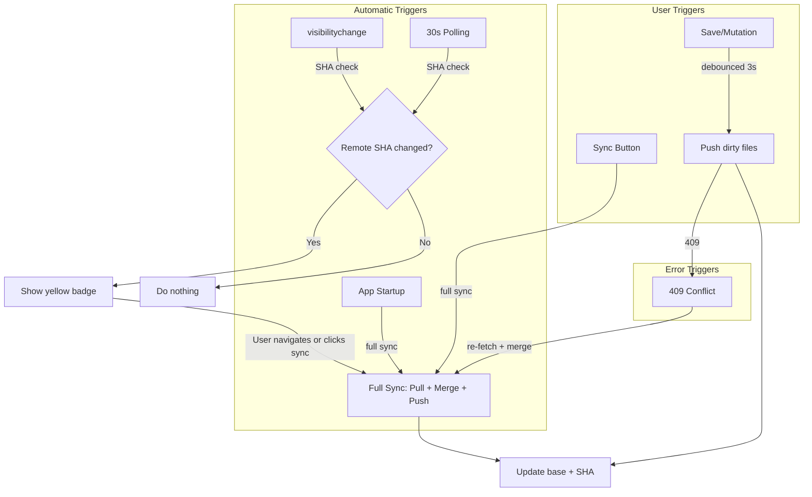
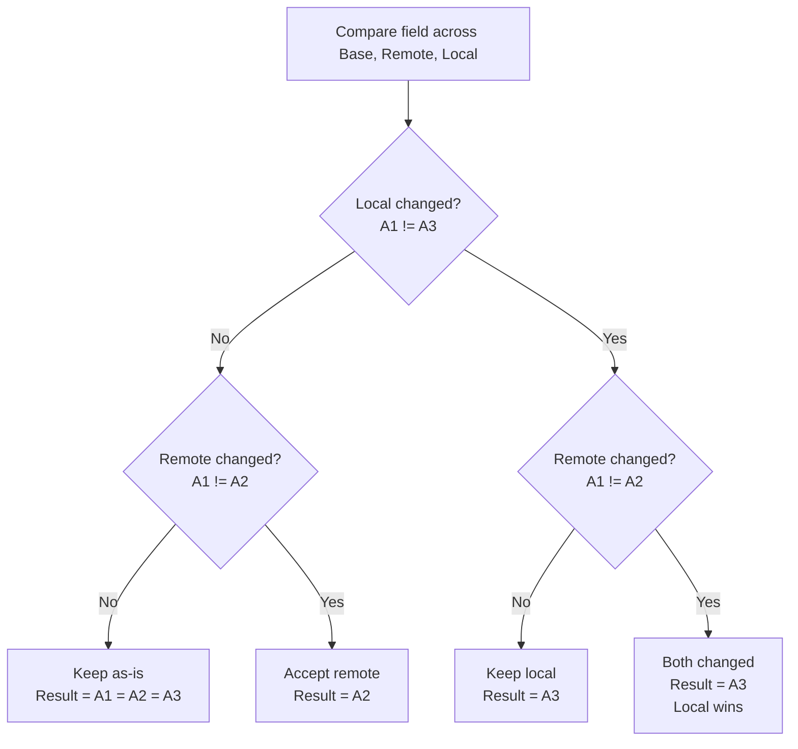
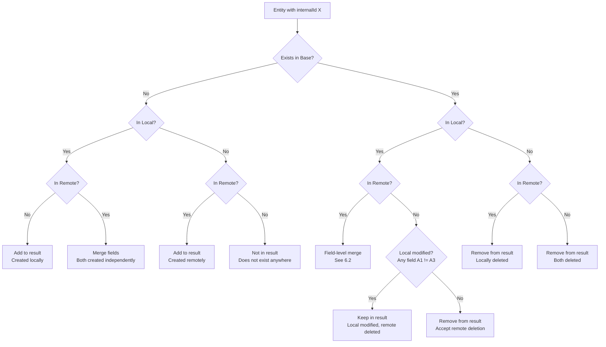
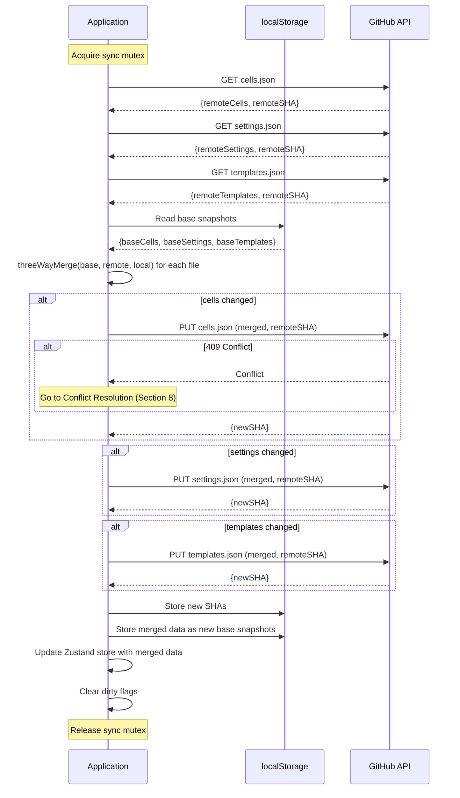
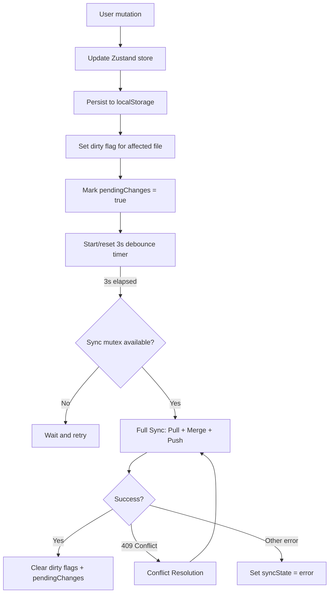
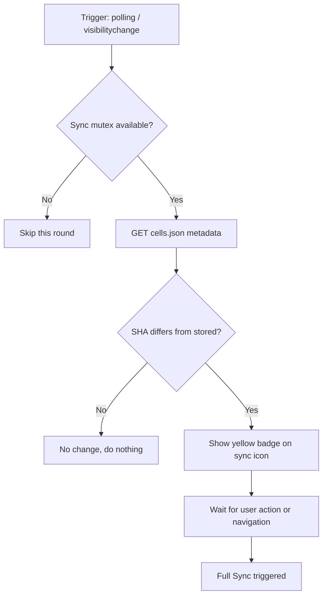
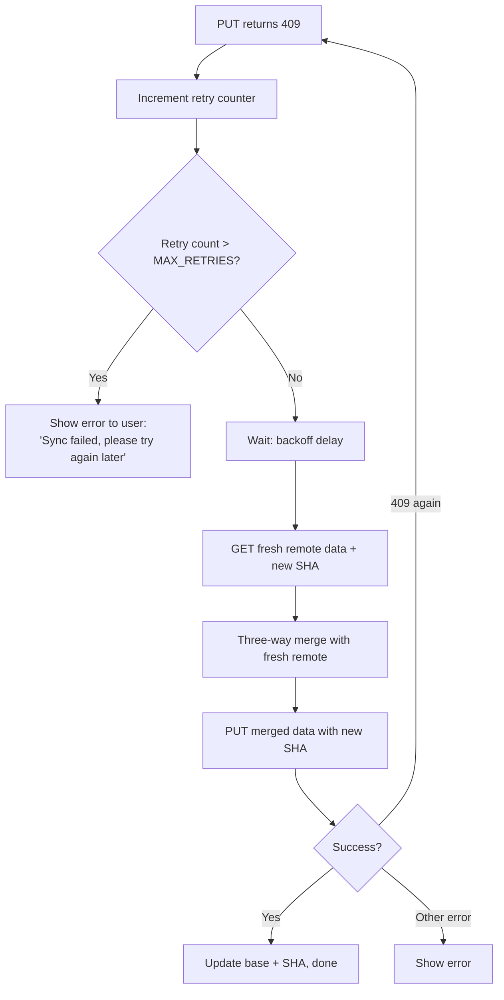
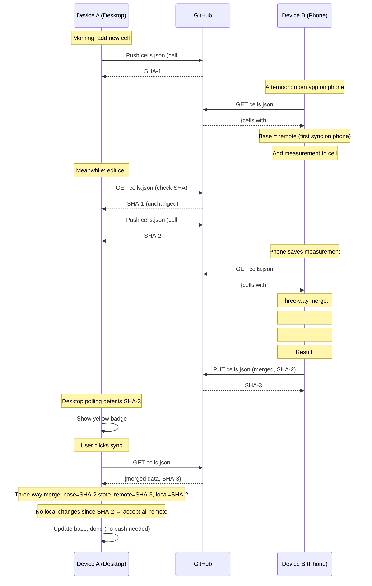
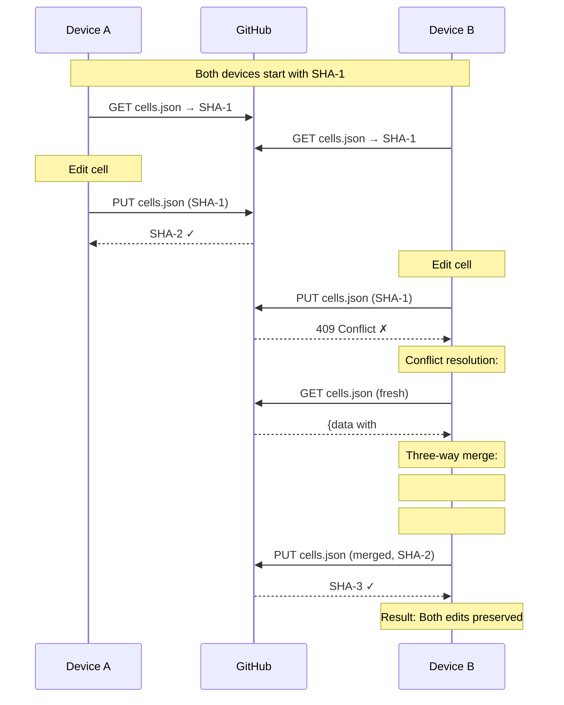

# Git Sync & Merge Specification

**Version:** 2.0
**Last Updated:** 2026-03-28
**Status:** Draft

---

## 1. Overview

The Battery Cell Tracker uses GitHub as a remote data store via the **GitHub Contents API**. Multiple devices (e.g., phone and desktop) can read and write the same data files. This document specifies the synchronization protocol, three-way merge algorithm, conflict resolution, and all related rules.

### 1.1 Design Goals

- **No data loss** - concurrent edits from multiple devices must be merged without losing changes
- **No backend** - sync operates directly between client browser and GitHub API
- **Deterministic** - merge results are predictable and reproducible
- **Resilient** - transient failures (network, API) are retried automatically
- **Remote protection** - the remote repository is never force-pushed; remote data is always preserved

### 1.2 Key Concepts

| Concept | Definition |
|---------|-----------|
| **Local** | Data currently in the browser's Zustand store / localStorage |
| **Remote** | Data stored in the GitHub repository |
| **Base** | Snapshot of data at the time of the last successful sync (stored in localStorage) |
| **SHA** | Git blob SHA hash returned by GitHub API; used for optimistic concurrency |
| **Three-way merge** | Comparing base, local, and remote to determine the correct merged result |
| **Dirty flag** | Boolean indicating a file has been modified locally since last sync |

---

## 2. File Structure on GitHub

```
{repository}/
├── cells.json                     # Cell inventory data
├── settings.json                  # Shared application settings
├── templates.json                 # Cell templates
└── settings_{clientId}.json       # Per-device client settings (one per device)
```

### 2.1 File Formats

**cells.json:**
```json
{
  "version": 1,
  "cells": [
    {
      "internalId": "550e8400-e29b-41d4-a716-446655440000",
      "id": "01",
      "brand": "Samsung",
      ...
      "measurements": [...],
      "events": [...],
      "createdAt": "2026-01-15T10:30:00.000Z",
      "updatedAt": "2026-03-28T14:22:00.000Z"
    }
  ]
}
```

**settings.json:**
```json
{
  "version": 1,
  "settings": {
    "scrapThresholdPercent": 60,
    "defaultTestDevice": "LiitoKala Lii-700",
    "defaultDischargeCurrent": 500,
    "defaultChargeCurrent": 1000,
    "devices": ["Raktaron", "E-bike #1"],
    "testDevices": ["LiitoKala Lii-700", "XTAR VC4SL"]
  }
}
```

**templates.json:**
```json
{
  "version": 1,
  "templates": [
    {
      "internalId": "...",
      "id": "...",
      "name": "Samsung 30Q",
      ...
      "createdAt": "...",
      "updatedAt": "..."
    }
  ]
}
```

**settings_{clientId}.json:**
```json
{
  "version": 1,
  "clientSettings": {
    "clientId": "fe12be",
    "theme": "dark",
    "language": "hu",
    "temperatureUnit": "celsius"
  }
}
```

---

## 3. GitHub Contents API Usage

### 3.1 API Details

| Parameter | Value |
|-----------|-------|
| Base URL | `https://api.github.com` |
| API version header | `X-GitHub-Api-Version: 2022-11-28` |
| Authentication | `Authorization: Bearer {PAT}` |
| Accept header | `Accept: application/vnd.github+json` |

### 3.2 Operations

#### Read File

```
GET /repos/{owner}/{repo}/contents/{path}
```

**Response (200):**
```json
{
  "content": "base64-encoded-content",
  "sha": "abc123...",
  "encoding": "base64"
}
```

**Response (404):** File does not exist.

The response `content` is Base64-encoded. Decode it to get the JSON string.

#### Create or Update File

```
PUT /repos/{owner}/{repo}/contents/{path}
```

**Request body (create):**
```json
{
  "message": "Update cells.json",
  "content": "base64-encoded-content"
}
```

**Request body (update):**
```json
{
  "message": "Update cells.json",
  "content": "base64-encoded-content",
  "sha": "abc123..."
}
```

The `sha` field is **required** for updates. It must match the current SHA of the file on GitHub. If another commit changed the file since we last read it, GitHub returns **409 Conflict**.

**Response (200/201):**
```json
{
  "content": {
    "sha": "def456..."
  }
}
```

The new SHA must be stored locally for the next update.

#### Delete File

```
DELETE /repos/{owner}/{repo}/contents/{path}
```

**Request body:**
```json
{
  "message": "Delete data.json",
  "sha": "abc123..."
}
```

Used only for legacy `data.json` cleanup after migration.

### 3.3 Limitations

| Constraint | Value |
|-----------|-------|
| Max file size (Contents API) | 1 MB |
| Max file size (Blob API) | 100 MB |
| Rate limit (authenticated) | 5,000 requests/hour |
| Commits | One file per commit (Contents API does not support atomic multi-file commits) |

**Important:** The Contents API creates **one commit per file update**. There is no way to atomically update multiple files in a single commit via this API. This means `cells.json` and `settings.json` can temporarily be out of sync between commits. The three-way merge algorithm handles this gracefully.

---

## 4. localStorage Keys for Sync

| Key | Content | Purpose |
|-----|---------|---------|
| `battery-sha-cells` | SHA string | Last known SHA of cells.json on GitHub |
| `battery-sha-settings` | SHA string | Last known SHA of settings.json |
| `battery-sha-templates` | SHA string | Last known SHA of templates.json |
| `battery-sha-clientsettings` | SHA string | Last known SHA of settings_{clientId}.json |
| `battery-sync-base-cells` | JSON string | Base snapshot of cells after last successful sync |
| `battery-sync-base-settings` | JSON string | Base snapshot of settings after last successful sync |
| `battery-sync-base-templates` | JSON string | Base snapshot of templates after last successful sync |
| `battery-last-remote-sha` | SHA string | Last known commit SHA from polling (for change detection) |

---

## 5. Sync Triggers

### 5.1 Trigger Table

| # | Trigger | Action | Details |
|---|---------|--------|---------|
| T1 | App startup | Full sync | Pull all files, merge, push if dirty |
| T2 | `visibilitychange` (visible) | Remote check | SHA comparison only; badge if changed |
| T3 | Before push | Pull first | Ensures merge before push |
| T4 | Sync button click | Full sync | Pull + merge + push |
| T5 | HTTP 409 on push | Re-fetch + re-merge | Automatic, up to max retries |
| T6 | 30-second polling | Remote check | SHA comparison only; badge if changed |

### 5.2 Trigger Behavior Diagram



### 5.3 Polling Implementation

```typescript
const POLL_INTERVAL_MS = 30_000;
let pollTimer: ReturnType<typeof setInterval> | null = null;
let syncMutex = false;

function startPolling() {
  pollTimer = setInterval(async () => {
    if (syncMutex) return;             // Skip if sync in progress
    const remoteChanged = await checkRemoteSHA();
    if (remoteChanged) {
      showRemoteChangeBadge();         // Yellow badge on sync icon
    }
  }, POLL_INTERVAL_MS);
}

async function checkRemoteSHA(): Promise<boolean> {
  // Single lightweight GET request
  // Compare response SHA with stored battery-sha-cells
  // Returns true if any file SHA differs
}
```

**Rules:**
- Polling **never** modifies local data
- Polling **never** triggers a merge
- If `syncMutex` is true (sync in progress), polling skips that round
- Badge clears after next successful full sync

### 5.4 Mutex Protection

All sync operations are protected by a mutex to prevent concurrent execution:

```typescript
async function withSyncMutex<T>(fn: () => Promise<T>): Promise<T> {
  if (syncMutex) throw new Error("Sync already in progress");
  syncMutex = true;
  try {
    return await fn();
  } finally {
    syncMutex = false;
  }
}
```

---

## 6. Three-Way Merge Algorithm

### 6.1 Core Principle

Three-way merge compares three versions of the data:

| Version | Symbol | Source | Description |
|---------|--------|--------|-------------|
| **Base** | A1 | localStorage snapshot | State at last successful sync |
| **Remote** | A2 | GitHub (fetched) | Current state on GitHub |
| **Local** | A3 | Zustand store | Current state in browser |

The merge determines what the **result** should be by analyzing what changed relative to the base.

### 6.2 Field-Level Merge Rules

For each field of each entity:



**Summary table:**

| Base == Local? | Base == Remote? | Result | Reason |
|---------------|----------------|--------|--------|
| Yes | Yes | Any (all same) | No changes |
| Yes | No | Remote (A2) | Only remote changed |
| No | Yes | Local (A3) | Only local changed |
| No | No | Local (A3) | Both changed, local wins |

**Why local wins on conflict:** The user actively editing on this device has the most recent intent. Since clients can have different clocks, we cannot rely on timestamps for field-level conflict resolution. The "last to commit" strategy ensures the active user's changes are preserved.

### 6.3 Entity-Level Merge Rules (Cells & Templates)

Entities are matched by `internalId` (UUID). The merge must also handle creation and deletion of entire entities.



**Summary table:**

| In Base | In Local | In Remote | Local Modified | Result | Rule |
|---------|----------|-----------|---------------|--------|------|
| No | Yes | No | - | Keep local | E1: Local creation |
| No | No | Yes | - | Keep remote | E2: Remote creation |
| No | Yes | Yes | - | Merge fields | E3: Independent creation |
| Yes | Yes | Yes | - | Merge fields | E4: Both have it |
| Yes | No | Yes | - | Delete | E5: Local deletion |
| Yes | Yes | No | Yes | Keep local | E6: Remote deleted, but local modified |
| Yes | Yes | No | No | Delete | E7: Remote deleted, local unmodified |
| Yes | No | No | - | Delete | E8: Both deleted |

### 6.4 Hard Delete

Cells use **hard delete** (entity removed from the array). There is no `deletedAt` field in V2.

The three-way merge handles deletions by comparing presence in base vs local vs remote (see rules E5-E8 above). This eliminates the need for soft delete markers.

### 6.5 Fields Excluded from Merge Comparison

The following fields are **administrative metadata** and are NOT compared during field-level merge. They are always taken from the winning side or recalculated:

| Field | Handling |
|-------|----------|
| `internalId` | Used as entity key, never changes |
| `createdAt` | Set once on creation, never changes |
| `updatedAt` | Set to `now()` after merge if any field changed |
| `events[]` | Merged by union (see 6.6) |

All other fields (brand, model, status, measurements, notes, etc.) are compared field by field.

### 6.6 Measurement Array Merge

Measurements are identified by their `id` (UUID). The measurement array is merged as a set:

| In Base | In Local | In Remote | Result |
|---------|----------|-----------|--------|
| No | Yes | No | Keep (locally added) |
| No | No | Yes | Keep (remotely added) |
| No | Yes | Yes | Keep one (same UUID means same measurement) |
| Yes | Yes | Yes | Field-level merge on measurement fields |
| Yes | No | Yes | Remove (locally deleted) |
| Yes | Yes | No | Keep (remotely deleted, but local has it - same as entity rule) |
| Yes | No | No | Remove (both deleted) |

**Note:** Measurement editing is rare (usually add or delete). If both sides edited the same measurement, local wins (same as field-level rule).

### 6.7 Event Array Merge

Events are **append-only**. Merge by union of event `id` values (deduplicate by UUID). Events are never edited or deleted.

### 6.8 Settings Merge

Settings is a flat object (not an array of entities). Each field is merged individually using the field-level rules from 6.2.

**Array fields** (`devices[]`, `testDevices[]`) are merged as sets:
- Items in remote but not in base → added (remote addition)
- Items in base but not in remote → removed (remote deletion), unless locally added
- Items in local but not in base → added (local addition)
- Items in base but not in local → removed (local deletion)

### 6.9 Template Merge

Same as cell merge (entity-level by `internalId`, field-level for each field). Templates use soft archive (`archived` flag) which is just another field to merge.

---

## 7. Sync Flow

### 7.1 Full Sync (Pull + Merge + Push)



### 7.2 Push Flow (Save Changes)



### 7.3 Remote Change Check Flow



---

## 8. Conflict Resolution

### 8.1 When Conflicts Occur

A conflict occurs when `PUT` returns **HTTP 409**. This means another device pushed changes between our `GET` (pull) and `PUT` (push).

### 8.2 Resolution Algorithm



### 8.3 Retry Parameters

| Parameter | Value |
|-----------|-------|
| MAX_RETRIES | 5 |
| Backoff formula | `1000 * 2^attempt` ms |
| Backoff sequence | 1s, 2s, 4s, 8s, 16s |

### 8.4 After Max Retries

When retry limit is reached:
- `syncState.status` set to `"error"`
- Error message displayed: "Sync failed after multiple attempts. Please refresh the page and try again."
- User can manually retry via sync button
- Local data is preserved (no data loss)
- **No force push** - remote data is never overwritten without merge

---

## 9. Dirty Flag System

### 9.1 Flags

```typescript
interface DirtyFlags {
  cellsDirty: boolean;
  settingsDirty: boolean;
  templatesDirty: boolean;
}
```

### 9.2 Flag Lifecycle

```
[Mutation] ──► Set dirty flag for affected file
                    │
              [Sync starts]
                    │
              [Push file] ──► Success ──► Clear dirty flag
                    │
                  Failure ──► Keep dirty flag (retry later)
```

### 9.3 Which Mutations Set Which Flag

| Mutation | Dirty Flag |
|----------|-----------|
| addCell, updateCell, deleteCell | `cellsDirty` |
| addMeasurement, deleteMeasurement | `cellsDirty` |
| updateSettings | `settingsDirty` |
| addTemplate, updateTemplate, archiveTemplate | `templatesDirty` |

### 9.4 Push Optimization

During push, only files with `dirty = true` are sent to GitHub:

```typescript
if (dirtyFlags.cellsDirty) {
  await pushFile("cells.json", cellsData, cellsSHA);
  dirtyFlags.cellsDirty = false;
}
if (dirtyFlags.settingsDirty) {
  await pushFile("settings.json", settingsData, settingsSHA);
  dirtyFlags.settingsDirty = false;
}
if (dirtyFlags.templatesDirty) {
  await pushFile("templates.json", templatesData, templatesSHA);
  dirtyFlags.templatesDirty = false;
}
```

---

## 10. Base Snapshot Management

### 10.1 What is the Base?

The base is a snapshot of the data **at the time of the last successful sync**. It represents the common ancestor for three-way merge.

### 10.2 When Base is Updated

The base is updated **only after a successful full sync** (pull + merge + push all succeeded):

```typescript
function updateBaseSnapshots(mergedCells, mergedSettings, mergedTemplates) {
  localStorage.setItem("battery-sync-base-cells", JSON.stringify(mergedCells));
  localStorage.setItem("battery-sync-base-settings", JSON.stringify(mergedSettings));
  localStorage.setItem("battery-sync-base-templates", JSON.stringify(mergedTemplates));
}
```

### 10.3 First Sync (No Base)

On the very first sync (or after data wipe), there is no base snapshot. In this case:

- If local data is empty: accept all remote data as-is
- If remote is empty: push all local data as-is
- If both have data: treat as if base is empty (all fields are "new"), merge by entity `internalId` with `updatedAt` timestamp as tiebreaker

### 10.4 Base Integrity

If base is corrupted or missing (e.g., localStorage cleared), the system falls back to timestamp-based merge (V1 behavior) for that sync cycle, then stores a new base after success.

---

## 11. Client Settings Sync

### 11.1 Client ID Generation

```typescript
function generateClientId(): string {
  const bytes = crypto.getRandomValues(new Uint8Array(3));
  return Array.from(bytes).map(b => b.toString(16).padStart(2, '0')).join('');
  // Result: 6-character hex string, e.g., "fe12be"
}
```

Generated once on first app launch, stored in `localStorage` under `battery-client-id`.

### 11.2 Client Settings File

Each device writes its own `settings_{clientId}.json`. No merge needed because only one device writes to each file.

**Sync flow:**
1. On startup: read own client settings from GitHub (if exists)
2. On save: push own client settings to GitHub
3. Never read or modify other devices' client settings files

### 11.3 Settings Split

| Field | File | Merge |
|-------|------|-------|
| scrapThresholdPercent | settings.json | Three-way |
| defaultTestDevice | settings.json | Three-way |
| defaultDischargeCurrent | settings.json | Three-way |
| defaultChargeCurrent | settings.json | Three-way |
| devices[] | settings.json | Three-way (set merge) |
| testDevices[] | settings.json | Three-way (set merge) |
| theme | settings_{clientId}.json | No merge |
| language | settings_{clientId}.json | No merge |
| temperatureUnit | settings_{clientId}.json | No merge |

---

## 12. Migration from V1

### 12.1 Legacy Format

V1 used a single `data.json` file or three files without three-way merge:

```json
{
  "version": 1,
  "settings": { ... },
  "cells": [ ... ]
}
```

### 12.2 Migration Steps

1. Check `battery-migrated-v2` flag in localStorage
2. If not migrated:
   a. Fetch `data.json` from GitHub (if exists)
   b. Split into `cells.json`, `settings.json`, `templates.json`
   c. Push individual files to GitHub
   d. Delete `data.json` from GitHub
   e. Set `battery-migrated-v2` = `"true"`
3. If already on multi-file but no base snapshots:
   a. Current remote data becomes the initial base snapshot
   b. No merge needed for first sync after migration

### 12.3 V1 to V2 Merge Migration

When upgrading from V1 (timestamp-based) to V2 (three-way merge):
- No base exists yet
- First V2 sync: pull remote, set as base, merge local changes on top
- After first successful sync, three-way merge is fully operational

---

## 13. Edge Cases & Error Handling

### 13.1 Edge Case Table

| Scenario | Handling |
|----------|---------|
| First sync, empty remote | Push local data, set as base |
| First sync, empty local | Pull remote data, set as base |
| First sync, both have data | Merge by internalId, updatedAt tiebreaker, set result as base |
| Base missing (localStorage cleared) | Fall back to updatedAt tiebreaker for this cycle |
| Remote file doesn't exist (404) | Create file on push |
| Network error during pull | Show error, keep local data unchanged |
| Network error during push | Keep dirty flag, retry on next trigger |
| Partial push (1 of 3 files fails) | Remaining files stay dirty, retry on next cycle |
| Same cell ID conflict (different internalId) | Suffix duplicate IDs: "01" → "01-2" |
| Both devices create cell with same internalId | Theoretically impossible (UUID collision ~0%), but merge by updatedAt |
| Empty measurement array after merge | Valid state (cell with no measurements) |
| Both devices delete same cell | Result: deleted (rule E8) |
| Device A deletes, device B edits same cell | Keep cell (rule E6, local modified wins) |
| Device A edits, device B deletes same cell | When syncing from A: keep (A modified). When syncing from B: depends on whether B modified other fields |
| Rate limit hit (429) | Show error, no retry (wait for rate limit reset) |
| File > 1 MB | Show warning; consider archiving old cells |

### 13.2 Data Integrity Checks

After every merge, validate:
1. No duplicate `internalId` values in cells array
2. No duplicate `id` values among active cells (resolve with suffix)
3. All required fields present (brand, nominalCapacity, etc.)
4. All measurements have valid `id` (UUID)
5. Version field matches expected DATA_VERSION

### 13.3 Recovery Options

| Problem | User Action |
|---------|------------|
| Sync stuck in error | Click sync button to retry |
| Persistent conflicts | Refresh page (re-pulls fresh remote) |
| Corrupted local data | Import from backup JSON |
| Corrupted remote data | Export local data, manually fix GitHub, re-import |
| Lost GitHub token | Re-enter in settings with PIN |

---

## 14. Sequence Diagrams

### 14.1 Typical Multi-Device Session



### 14.2 Conflict During Push



---

## 15. Implementation Checklist

### 15.1 Core Modules

| Module | File | Responsibility |
|--------|------|---------------|
| GitHub Client | `src/lib/github.ts` | HTTP calls to GitHub Contents API |
| Sync Engine | `src/lib/sync.ts` | Orchestrates pull/merge/push, retry logic |
| Merge Engine | `src/lib/merge.ts` (new) | Three-way merge algorithm |
| Store | `src/lib/store.ts` | Dirty flags, mutation tracking, debounced sync |
| Sync Hook | `src/hooks/useSync.ts` | Polling, visibility change, badge state |

### 15.2 Functions to Implement

| Function | Module | Purpose |
|----------|--------|---------|
| `threeWayMergeCells(base, remote, local)` | merge.ts | Cell array merge |
| `threeWayMergeSettings(base, remote, local)` | merge.ts | Settings object merge |
| `threeWayMergeTemplates(base, remote, local)` | merge.ts | Template array merge |
| `mergeEntityFields(base, remote, local)` | merge.ts | Field-level merge for single entity |
| `mergeArrayAsSet(base, remote, local)` | merge.ts | Set-style array merge (devices, testDevices) |
| `mergeMeasurements(base, remote, local)` | merge.ts | Measurement array merge by UUID |
| `mergeEvents(base, remote, local)` | merge.ts | Event array union by UUID |
| `saveBaseSnapshot(file, data)` | sync.ts | Store base in localStorage |
| `loadBaseSnapshot(file)` | sync.ts | Load base from localStorage |
| `checkRemoteSHA()` | sync.ts | Lightweight remote change check |
| `startPolling()` / `stopPolling()` | useSync.ts | 30s polling lifecycle |

---

## 16. Glossary

| Term | Definition |
|------|-----------|
| **Base** | Data snapshot from last successful sync; the common ancestor for merge |
| **Remote** | Data currently stored on GitHub |
| **Local** | Data currently in the browser (Zustand store + localStorage) |
| **SHA** | Git content hash; used by GitHub for optimistic concurrency control |
| **Dirty flag** | Indicates a file has unsaved local changes |
| **Mutex** | Lock preventing concurrent sync operations |
| **Polling** | Periodic background check for remote changes |
| **Three-way merge** | Algorithm comparing base, remote, and local to produce merged result |
| **Contents API** | GitHub REST API for reading/writing individual files in a repository |
| **PAT** | Fine-grained Personal Access Token for GitHub authentication |
