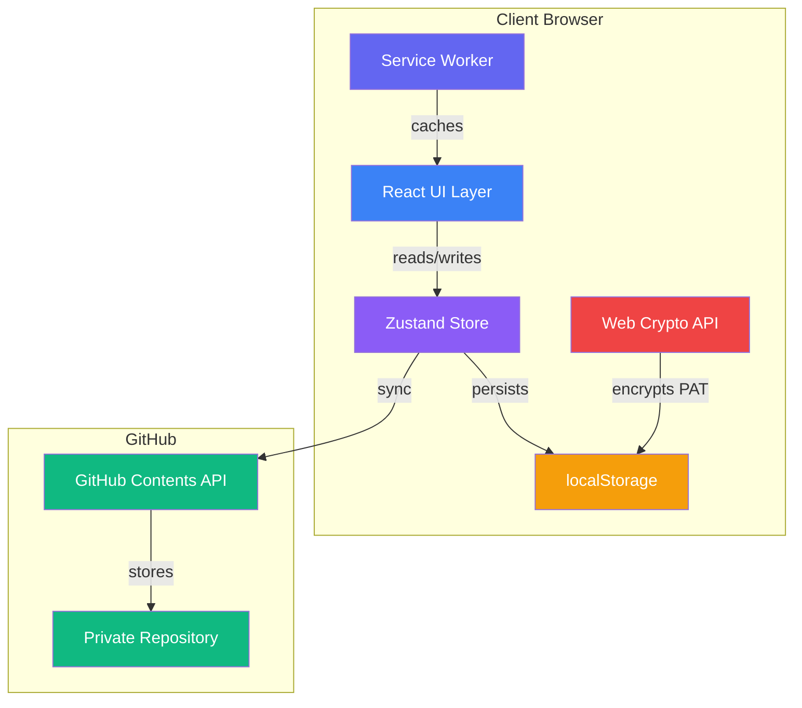
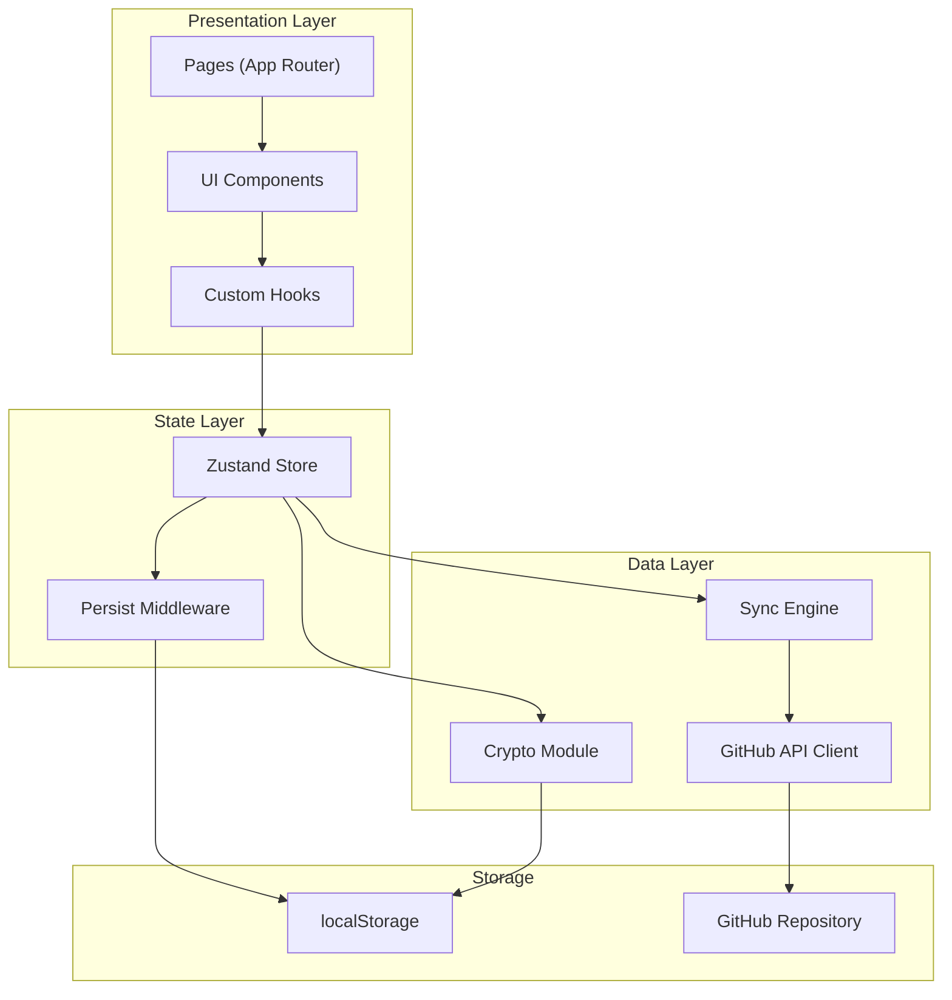
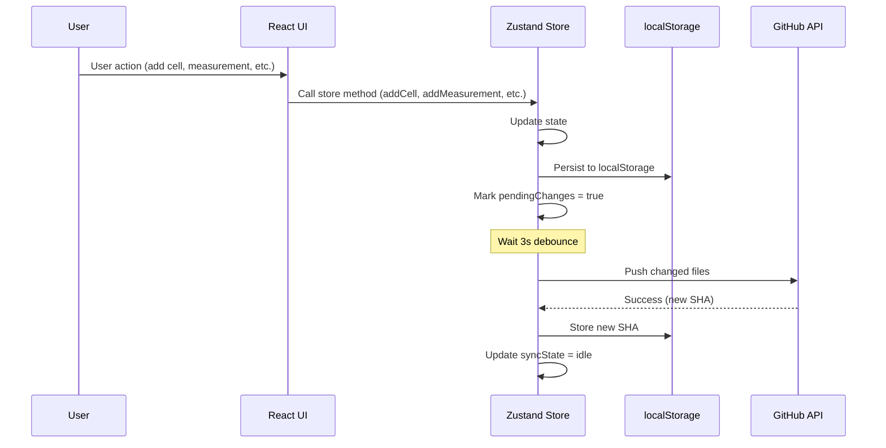
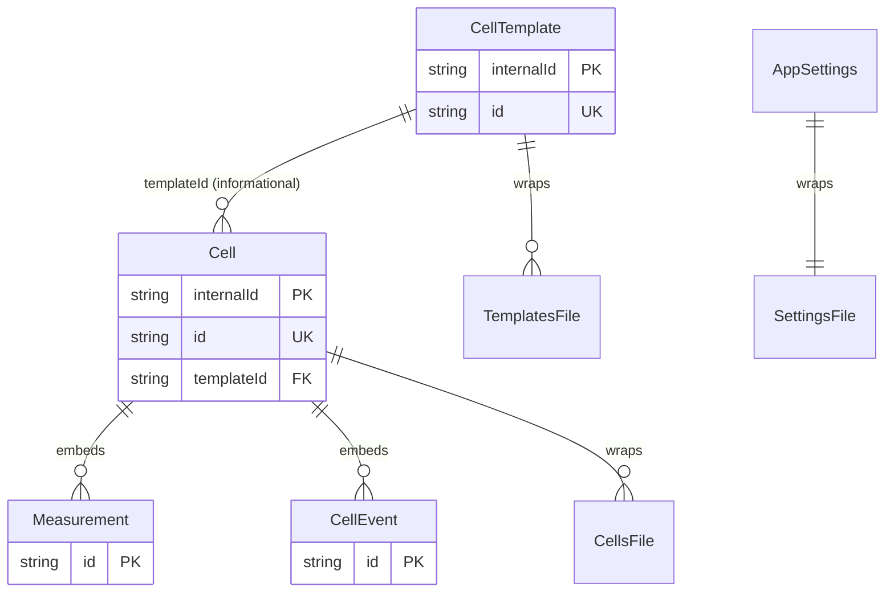
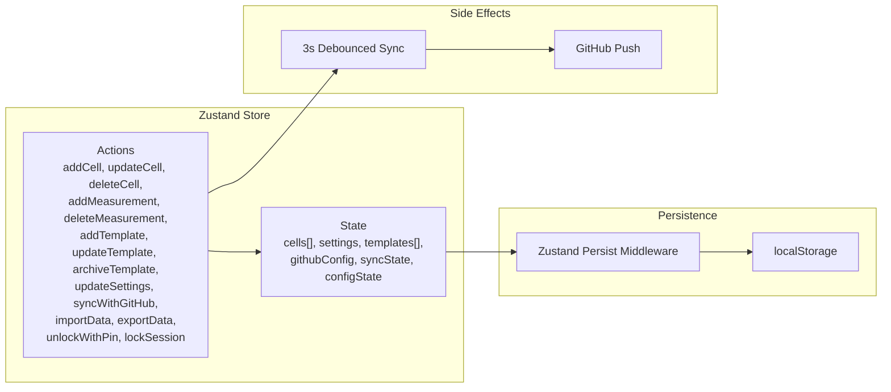
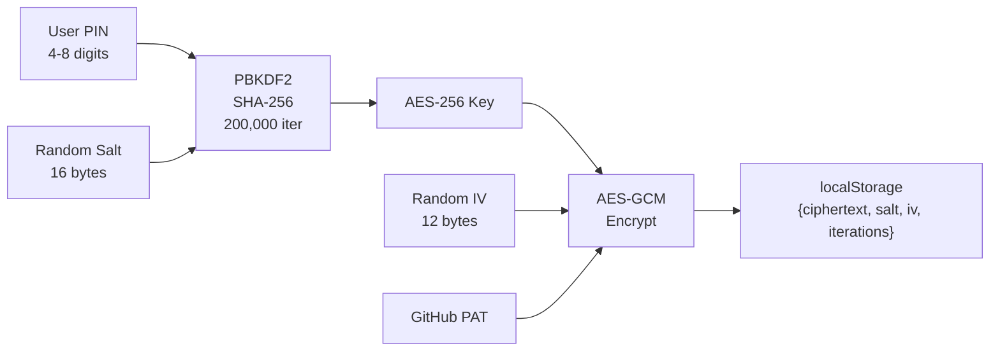
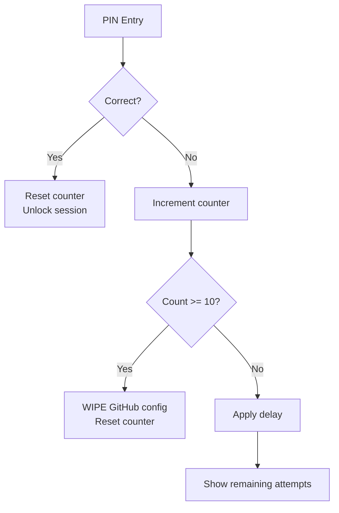
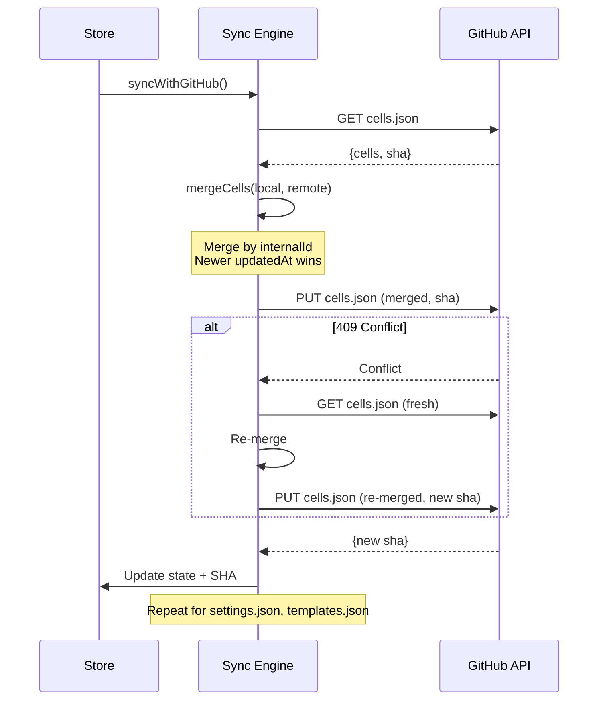
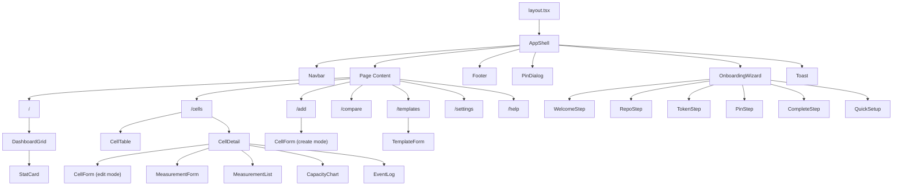
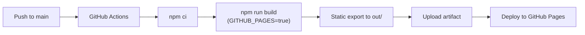

# Battery Cell Tracker - Technical Specification

**Version:** 2.0
**Last Updated:** 2026-03-28
**Status:** Draft

---

## 1. Technology Stack

### 1.1 Core Framework

| Technology | Version | Purpose |
|-----------|---------|---------|
| Next.js | 16.2.1 | App framework (App Router, static export) |
| React | 19.0.0 | UI library |
| TypeScript | 5.x (strict mode) | Type safety |
| Tailwind CSS | 4.x | Utility-first styling |
| Zustand | 5.0.5 | State management with localStorage persistence |
| Recharts | 2.15.3 | Data visualization (capacity trend charts) |
| uuid | 11.1.0 | UUID generation for internal IDs |
| jsqr | 1.4.0 | QR code reading for quick setup |

### 1.2 Dev Dependencies

| Technology | Version | Purpose |
|-----------|---------|---------|
| ESLint | 9.x | Linting with TypeScript, React, React Hooks plugins |
| @tailwindcss/postcss | 4.x | PostCSS integration for Tailwind |
| @types/react | 19.x | React type definitions |
| @types/node | 22.x | Node.js type definitions |

### 1.3 Build Configuration

**next.config.ts:**
```typescript
const nextConfig: NextConfig = {
  output: "export",                                    // Static HTML export
  basePath: isGitHubPages ? "/battery" : "",           // Conditional for GitHub Pages
  assetPrefix: isGitHubPages ? "/battery/" : "",
  images: { unoptimized: true },                       // No server-side image optimization
  trailingSlash: true,                                 // Trailing slashes on all routes
};
```

**tsconfig.json:**
- Target: ES2017
- Module: esnext
- Module resolution: bundler
- Strict mode: enabled
- Path alias: `@/*` maps to `./src/*`

**postcss.config.mjs:**
```javascript
{ plugins: { "@tailwindcss/postcss": {} } }
```

---

## 2. Architecture Overview

### 2.1 High-Level Architecture



**Key principle:** Zero backend. The browser is the application server. GitHub is a dumb key-value store accessed via REST API. No data passes through any intermediary server.

### 2.2 Application Layers



### 2.3 Data Flow



---

## 3. Project Structure

```
battery/
├── docs/                          # Documentation
├── public/
│   ├── manifest.json              # PWA manifest
│   ├── sw.js                      # Service Worker
│   ├── icon.svg                   # Vector icon
│   ├── icon-192.png               # PWA icon 192x192
│   └── icon-512.png               # PWA icon 512x512
├── src/
│   ├── app/                       # Next.js App Router pages
│   │   ├── layout.tsx             # Root layout (metadata, fonts, viewport)
│   │   ├── page.tsx               # Dashboard (/)
│   │   ├── cells/page.tsx         # Cell list + detail (/cells, /cells?id=X)
│   │   ├── add/page.tsx           # New cell form (/add)
│   │   ├── compare/page.tsx       # Cell comparison (/compare)
│   │   ├── templates/page.tsx     # Template management (/templates)
│   │   ├── settings/page.tsx      # Settings (/settings)
│   │   └── help/page.tsx          # Help & docs (/help)
│   ├── components/
│   │   ├── layout/
│   │   │   ├── AppShell.tsx       # App wrapper (theme, session, online detection)
│   │   │   ├── Navbar.tsx         # Navigation bar (desktop + mobile)
│   │   │   └── Footer.tsx         # Footer
│   │   ├── cells/
│   │   │   ├── CellTable.tsx      # Filterable, sortable cell table
│   │   │   ├── CellForm.tsx       # Cell create/edit form
│   │   │   ├── CellDetail.tsx     # Cell detail view with all sections
│   │   │   ├── StatusBadge.tsx    # Colored status pill
│   │   │   └── EventLog.tsx       # Cell event timeline
│   │   ├── measurements/
│   │   │   ├── MeasurementForm.tsx    # Add measurement form
│   │   │   ├── MeasurementList.tsx    # Measurement table
│   │   │   └── CapacityChart.tsx      # Recharts line chart
│   │   ├── templates/
│   │   │   └── TemplateForm.tsx   # Template create/edit form
│   │   ├── dashboard/
│   │   │   ├── DashboardGrid.tsx  # Dashboard layout with stats
│   │   │   └── StatCard.tsx       # Individual stat card
│   │   ├── onboarding/
│   │   │   ├── OnboardingWizard.tsx   # 5-step wizard
│   │   │   ├── WelcomeStep.tsx
│   │   │   ├── RepoStep.tsx
│   │   │   ├── TokenStep.tsx
│   │   │   ├── PinStep.tsx
│   │   │   ├── CompleteStep.tsx
│   │   │   └── QuickSetup.tsx     # QR-based setup alternative
│   │   └── ui/
│   │       ├── Button.tsx         # Button variants
│   │       ├── Input.tsx          # Text/number input
│   │       ├── Select.tsx         # Dropdown select
│   │       ├── ComboBox.tsx       # Searchable select with custom values
│   │       ├── Modal.tsx          # Modal dialog
│   │       ├── ConfirmDialog.tsx  # Confirmation modal
│   │       ├── Toast.tsx          # Toast notifications
│   │       └── PinDialog.tsx      # PIN unlock dialog
│   ├── lib/
│   │   ├── types.ts               # All TypeScript interfaces & type aliases
│   │   ├── store.ts               # Zustand store (state + CRUD + persistence)
│   │   ├── github.ts              # GitHub Contents API client
│   │   ├── sync.ts                # Multi-file sync engine with merge
│   │   ├── crypto.ts              # AES-256-GCM encryption with PBKDF2
│   │   ├── constants.ts           # Dropdowns, defaults, file paths
│   │   ├── utils.ts               # Formatting helpers
│   │   ├── i18n.ts                # Hungarian/English translations (200+ keys)
│   │   └── scrap-detection.ts     # Auto-scrap threshold logic
│   └── hooks/
│       ├── useCells.ts            # Cell filtering, sorting, stats
│       ├── useGitHub.ts           # Token validation hook
│       └── useSync.ts             # Sync lifecycle hook
├── next.config.ts
├── tsconfig.json
├── eslint.config.mjs
├── postcss.config.mjs
├── package.json
└── CLAUDE.md
```

---

## 4. Data Model

### 4.1 Type Definitions

#### Cell

```typescript
interface Cell {
  internalId: string;                       // UUID v4, stable sync identifier
  id: string;                               // User-assigned ID (e.g., "01", "A1")
  templateId?: string;                      // Reference to CellTemplate (informational only)
  brand: string;                            // e.g., "Samsung"
  model?: string;                           // e.g., "INR18650-30Q"
  formFactor: FormFactor;                   // e.g., "18650"
  chemistry: Chemistry;                     // e.g., "Li-ion"
  cathodeType?: string;                     // e.g., "INR"
  contactType?: string;                     // e.g., "Flat top"
  platform: string;                         // Purchase platform
  seller: string;                           // Seller name
  purchaseDate: string;                     // ISO date (YYYY-MM-DD)
  purchaseUrl?: string;                     // Product URL
  pricePerUnit: number;                     // Price in local currency
  nominalCapacity: number;                  // Rated capacity in mAh
  continuousDischargeCurrent?: number;      // Continuous discharge in A
  peakDischargeCurrent?: number;            // Peak discharge in A
  weight?: number;                          // Weight in grams
  storageVoltage?: number;                  // Storage voltage in V
  batchNumber?: string;                     // Batch/lot number
  status: CellStatus;                       // Current status
  currentDevice?: string;                   // Where the cell is currently placed
  group?: string;                           // Grouping label
  notes?: string;                           // Free-form notes
  measurements: Measurement[];              // Embedded measurement array
  events: CellEvent[];                      // Embedded event log
  createdAt: string;                        // ISO timestamp
  updatedAt: string;                        // ISO timestamp
}
```

#### Measurement (current + planned V2 fields)

```typescript
interface Measurement {
  id: string;                               // UUID v4
  date: string;                             // ISO date (YYYY-MM-DD)
  measuredCapacity: number;                 // Measured capacity in mAh (required)
  dischargeCurrent: number;                 // Discharge current in mA (required)
  chargeCurrent?: number;                   // Charge current in mA
  internalResistance?: number;              // Internal resistance in milliohms
  testDevice: string;                       // Test device name
  notes?: string;                           // Free-form notes
  // V2 fields (planned):
  weight?: number;                          // Cell weight at measurement time (grams)
  chargeTemperature?: number;               // Temperature during charge (Celsius)
  dischargeTemperature?: number;            // Temperature during discharge (Celsius)
  ambientTemperature?: number;              // Ambient temperature (Celsius)
  chargeTime?: number;                      // Charge duration (minutes)
  dischargeTime?: number;                   // Discharge duration (minutes)
}
```

#### CellTemplate

```typescript
interface CellTemplate {
  internalId?: string;                      // UUID v4 (optional for legacy)
  id: string;                               // UUID v4
  name: string;                             // Template name (required)
  brand: string;                            // Brand (required)
  model?: string;                           // Model
  formFactor: FormFactor;                   // Form factor (required)
  chemistry: Chemistry;                     // Chemistry (required)
  cathodeType?: string;
  contactType?: string;
  nominalCapacity: number;                  // mAh (required)
  continuousDischargeCurrent?: number;      // A
  peakDischargeCurrent?: number;            // A
  weight?: number;                          // grams
  archived?: boolean;                       // Soft archive flag
  createdAt: string;                        // ISO timestamp
  updatedAt: string;                        // ISO timestamp
}
```

#### CellEvent

```typescript
interface CellEvent {
  id: string;                               // UUID v4
  date: string;                             // ISO timestamp
  type: CellEventType;                      // Event type enum
  description: string;                      // Human-readable description
}

type CellEventType =
  | "created" | "edited" | "status_changed" | "device_changed"
  | "measurement_added" | "measurement_deleted"
  | "auto_scrapped" | "deleted";
```

#### Settings (current + planned V2 split)

```typescript
// Shared settings (synced across devices)
interface AppSettings {
  scrapThresholdPercent: number;            // 20-90, default 60
  defaultTestDevice: string;                // Default: "LiitoKala Lii-700"
  defaultDischargeCurrent: number;          // Default: 500 mA
  defaultChargeCurrent: number;             // Default: 1000 mA
  devices: string[];                        // Cell placement options
  testDevices: string[];                    // Test device options
  // V2: theme and language move to ClientSettings
  theme: Theme;                             // "light" | "dark" | "system"
  language: Language;                       // "hu" | "en"
}

// V2: Client-specific settings (per device, not shared)
interface ClientSettings {
  clientId: string;                         // 6-digit hex (e.g., "fe12be")
  theme: Theme;                             // "light" | "dark" | "system"
  language: Language;                       // "hu" | "en"
  temperatureUnit: TemperatureUnit;         // "celsius" | "fahrenheit"
}
```

#### Sync-Related Types

```typescript
interface GitHubConfig {
  token: string;                            // Fine-grained PAT
  owner: string;                            // GitHub username
  repo: string;                             // Repository name
  filePath: string;                         // Legacy field (unused in multi-file)
}

interface SyncState {
  status: "idle" | "syncing" | "error" | "conflict";
  lastSynced: string | null;                // ISO timestamp
  error: string | null;
  pendingChanges: boolean;
  retryCount: number;
}

interface CellsFile {
  version: number;                          // DATA_VERSION = 1
  cells: Cell[];
}

interface SettingsFile {
  version: number;
  settings: AppSettings;
}

interface TemplatesFile {
  version: number;
  templates: CellTemplate[];
}
```

#### Enumerations

```typescript
type CellStatus = "Uj" | "Hasznalt" | "Bontott" | "Selejt";
type Chemistry = "Li-ion" | "LiFePO4" | "NiMH" | "NiCd" | "LiPo";
type FormFactor = "18650" | "21700" | "26650" | "14500"
                | "AA" | "AAA" | "C" | "D" | "Egyeb";
type Theme = "light" | "dark" | "system";
type Language = "hu" | "en";
type TemperatureUnit = "celsius" | "fahrenheit";           // V2
```

### 4.2 Entity Relationships



Note: Measurements and events are **embedded** inside the Cell document (not separate entities). This simplifies sync since the cell is the unit of merge.

---

## 5. State Management

### 5.1 Zustand Store Architecture



### 5.2 localStorage Keys

| Key | Content | Format |
|-----|---------|--------|
| `battery-data` | Cells + settings (main data) | `{ version, cells[], settings }` |
| `battery-templates` | Cell templates | `CellTemplate[]` |
| `battery-github-config` | Encrypted GitHub config | `StoredConfig` (see 6.1) |
| `battery-sha-cells` | SHA for cells.json on GitHub | `string` |
| `battery-sha-settings` | SHA for settings.json on GitHub | `string` |
| `battery-sha-templates` | SHA for templates.json on GitHub | `string` |
| `battery-github-sha` | Legacy single-file SHA | `string` (deprecated) |
| `battery-pin-attempts` | PIN attempt counter + timestamp | `{ count, lastAttempt }` |
| `battery-migrated-v2` | Multi-file migration flag | `"true"` |
| `battery-sync-base-*` | V2: Base snapshots for three-way merge | `JSON` (planned) |
| `battery-client-id` | V2: Client identifier | `string` (6-digit hex, planned) |

### 5.3 State Mutation Flow

Every store mutation follows this pattern:

```typescript
// 1. Update state
set((state) => ({ cells: [...updated] }));

// 2. Persist to localStorage
persist();

// 3. Mark sync needed
markPending(set);

// 4. Trigger debounced sync (if GitHub configured)
if (get().githubConfig) {
  debouncedSync(() => get().syncWithGitHub());
}
```

**Change counter** ensures no data loss during concurrent sync:
```typescript
let changeCounter = 0;

function markPending(set) {
  changeCounter++;
  set((state) => ({ syncState: { ...state.syncState, pendingChanges: true } }));
}

// In syncWithGitHub():
const counterBefore = changeCounter;
await push();
// If counter changed during push, keep pendingChanges = true
if (changeCounter === counterBefore) {
  set({ syncState: { pendingChanges: false } });
}
```

### 5.4 Sync Debouncing

```
User action ─────┐
                  │ 0ms
User action ─────┤
                  │ 0ms
User action ─────┤
                  │ 3000ms (SYNC_DEBOUNCE_MS)
                  └──────► syncWithGitHub()
```

If new changes arrive during sync, the `changeCounter` difference triggers another sync cycle after the current one completes.

---

## 6. Security

### 6.1 Token Encryption



**Stored format:**
```typescript
interface StoredConfig {
  type: "encrypted";
  encrypted: {
    ciphertext: string;     // base64-encoded AES-GCM output
    salt: string;           // base64-encoded 16-byte salt
    iv: string;             // base64-encoded 12-byte IV
    iterations?: number;    // 200000 (stored for forward compatibility)
  };
  owner: string;            // GitHub owner (plaintext, needed before unlock)
  repo: string;             // Repository name (plaintext)
  filePath: string;         // Legacy field
}
```

**Crypto parameters:**

| Parameter | Value |
|-----------|-------|
| Algorithm | AES-256-GCM |
| Key derivation | PBKDF2 |
| Hash function | SHA-256 |
| Iterations (current) | 200,000 |
| Iterations (legacy) | 100,000 |
| Key length | 256 bits |
| Salt length | 16 bytes |
| IV length | 12 bytes |

**Legacy support:** Decryption first tries stored iterations, then falls back to 100,000 for data encrypted before the iteration upgrade.

### 6.2 PIN Lockout



**Lockout delays:**

| Attempt | Delay |
|---------|-------|
| 1-3 | 0 ms |
| 4 | 2,000 ms |
| 5 | 5,000 ms |
| 6 | 10,000 ms |
| 7 | 15,000 ms |
| 8 | 30,000 ms |
| 9 | 60,000 ms |
| 10 | Config wiped |

### 6.3 Session Management

- **Timeout:** 30 minutes of inactivity
- **Tracked events:** `mousedown`, `keydown`, `touchstart`, `scroll`
- **On timeout:** Session locked, PIN required to re-enter
- **State transition:** `"unlocked"` -> `"encrypted"` (back to PIN prompt)

### 6.4 Security Boundaries

| Data | Storage | Encrypted | Accessible to |
|------|---------|-----------|---------------|
| Cell data | localStorage + GitHub | No (public to repo owner) | Browser + GitHub |
| GitHub PAT | localStorage only | Yes (AES-256-GCM) | Browser only |
| PIN | Never stored | N/A | User's memory only |
| Settings | localStorage + GitHub | No | Browser + GitHub |

---

## 7. GitHub API Integration

### 7.1 API Configuration

| Parameter | Value |
|-----------|-------|
| Base URL | `https://api.github.com` |
| API Version | `2022-11-28` |
| Auth | `Bearer {PAT}` |
| Accept | `application/vnd.github+json` |
| Content encoding | Base64 (for file content) |

### 7.2 API Endpoints Used

| Operation | Method | Endpoint | Purpose |
|-----------|--------|----------|---------|
| Read file | GET | `/repos/{owner}/{repo}/contents/{path}` | Fetch file content + SHA |
| Create/Update file | PUT | `/repos/{owner}/{repo}/contents/{path}` | Save file (requires SHA for update) |
| Delete file | DELETE | `/repos/{owner}/{repo}/contents/{path}` | Delete file (requires SHA) |
| Validate token | GET | `/repos/{owner}/{repo}` | Check token validity |

### 7.3 Error Handling

| HTTP Status | Error Code | Action |
|-------------|-----------|--------|
| 401, 403 | TOKEN_EXPIRED | Show re-auth prompt |
| 404 | REPO_NOT_FOUND | Show configuration error |
| 409 | CONFLICT | Fetch remote, merge, retry |
| 422 | VALIDATION_ERROR | Show error message |
| 429 | RATE_LIMITED | Show rate limit message |
| 5xx | SERVER_ERROR | Retry with backoff |

### 7.4 File Structure on GitHub

```
{user's-repo}/
├── cells.json                    # { version: 1, cells: Cell[] }
├── settings.json                 # { version: 1, settings: AppSettings }
├── templates.json                # { version: 1, templates: CellTemplate[] }
├── settings_{clientId}.json      # V2: { version: 1, clientSettings: ClientSettings }
└── data.json                     # Legacy (auto-migrated, then deleted)
```

### 7.5 Retry Logic

| Parameter | Value |
|-----------|-------|
| Max retries per file | 3 |
| Backoff formula | `1000 * 2^attempt` ms |
| Retryable errors | 409 (Conflict), 5xx (Server Error) |
| Non-retryable errors | 401, 403, 404, 422, 429 |

---

## 8. Sync Engine

Detailed sync algorithm documented in [Git Sync & Merge Specification](git-sync-merge-specification.md).

### 8.1 Current Implementation (V1)



**V1 merge strategy:** Entity-level, newer `updatedAt` wins for the entire object.

### 8.2 Planned Implementation (V2)

**Three-way field-level merge** with base snapshot tracking. See [Git Sync & Merge Specification](git-sync-merge-specification.md) for the complete algorithm.

Key changes:
- Store base snapshot after each successful sync
- Compare fields individually: base vs local vs remote
- Entity-level rules for creation/deletion
- Hard delete instead of soft delete
- Only push dirty files
- 30-second polling for remote change detection (SHA check only)

### 8.3 Sync Triggers (V2)

| Trigger | Action | Details |
|---------|--------|---------|
| App startup | Full pull + merge | First thing after unlock |
| `visibilitychange` (visible) | SHA check | Tab focus, mobile wake |
| Before push | Pull + merge | Ensures latest base |
| Sync button | Full pull + merge + push | Manual trigger |
| HTTP 409 | Fetch + re-merge + retry | Up to 5 retries |
| 30s polling | SHA check only | Badge if changed, no auto-merge |

### 8.4 Dirty Flags (V2)

```typescript
interface DirtyFlags {
  cellsDirty: boolean;
  settingsDirty: boolean;
  templatesDirty: boolean;
}
```

Only dirty files are pushed. Flag set on mutation, cleared on successful push.

---

## 9. PWA Configuration

### 9.1 Manifest

```json
{
  "name": "Battery Cell Tracker",
  "short_name": "Battery",
  "description": "Battery cell inventory and measurement tracker",
  "start_url": "./",
  "display": "standalone",
  "background_color": "#f9fafb",
  "theme_color": "#2563eb",
  "orientation": "any",
  "icons": [
    { "src": "icon-192.png", "sizes": "192x192", "type": "image/png", "purpose": "any maskable" },
    { "src": "icon-512.png", "sizes": "512x512", "type": "image/png", "purpose": "any maskable" }
  ]
}
```

### 9.2 Service Worker

- **Cache name:** `battery-v1`
- **Strategy:** Network-first with cache fallback
- **Pre-cached:** `/`, `manifest.json`, icons
- **Excluded:** `api.github.com` requests (never cached)
- **Navigation fallback:** Serves cached index for offline page navigation

### 9.3 Viewport & Theme

```typescript
// Root layout metadata
viewport: {
  width: "device-width",
  initialScale: 1,
  maximumScale: 1,
  themeColor: [
    { media: "(prefers-color-scheme: light)", color: "#2563eb" },
    { media: "(prefers-color-scheme: dark)", color: "#1e3a5f" },
  ],
}
```

---

## 10. Internationalization

### 10.1 Implementation

- **Module:** `src/lib/i18n.ts`
- **Languages:** Hungarian (`hu`), English (`en`)
- **Function:** `t(key: TranslationKey, language: Language, options?: Record<string, string>): string`
- **Keys:** 200+ translation keys
- **Interpolation:** `{placeholder}` syntax (e.g., `"Összesen {count} cella"`)

### 10.2 Translation Categories

| Prefix | Area |
|--------|------|
| `nav.*` | Navigation |
| `dashboard.*` | Dashboard |
| `cell.*`, `cells.*` | Cell list & detail |
| `form.*` | Form labels |
| `tooltip.*` | Input help text |
| `measurement.*` | Measurement form & list |
| `settings.*` | Settings page |
| `chart.*` | Chart labels |
| `table.*` | Table headers |
| `validation.*` | Error messages |
| `warning.*` | Warnings |
| `event.*` | Event descriptions |
| `compare.*` | Comparison page |
| `profile.*` | Cell profile card |
| `pin.*` | PIN dialog |
| `onboarding.*` | Setup wizard |

### 10.3 Language Detection (V2)

Temperature unit default detected from `navigator.language`:
- `en-US`, `en-LR`, `my-MM` -> Fahrenheit
- Everything else -> Celsius

---

## 11. Component Architecture

### 11.1 Component Hierarchy



### 11.2 UI Component Library

All reusable UI components in `src/components/ui/`:

| Component | Props | Purpose |
|-----------|-------|---------|
| `Button` | variant, size, disabled, onClick | Action buttons |
| `Input` | type, label, error, value, onChange | Text/number inputs |
| `Select` | options, value, onChange, label | Dropdown selects |
| `ComboBox` | options, value, onChange, allowCustom | Searchable select with custom values |
| `Modal` | isOpen, onClose, title, children | Modal overlay |
| `ConfirmDialog` | isOpen, onConfirm, onCancel, message | Confirmation dialog |
| `Toast` | message, type (success/error/info) | Notification toast |
| `PinDialog` | isOpen, onUnlock, configState | PIN unlock form |

### 11.3 Routing

All pages are **client components** (`"use client"`) because data comes from localStorage/Zustand.

| Route | File | Query Params | Purpose |
|-------|------|-------------|---------|
| `/` | `app/page.tsx` | - | Dashboard |
| `/cells` | `app/cells/page.tsx` | `?id=X` | Cell list or detail |
| `/add` | `app/add/page.tsx` | - | New cell form |
| `/compare` | `app/compare/page.tsx` | - | Cell comparison |
| `/templates` | `app/templates/page.tsx` | - | Template management |
| `/settings` | `app/settings/page.tsx` | - | Settings |
| `/help` | `app/help/page.tsx` | - | Help & docs |

No dynamic routes (constraint of `output: "export"`). Detail views use query parameters.

---

## 12. Auto-Scrap Detection

### 12.1 Algorithm

```typescript
function shouldMarkAsScrap(cell: Cell, settings: AppSettings): boolean {
  if (cell.measurements.length === 0) return false;
  const latest = cell.measurements.sort((a, b) =>
    b.date.localeCompare(a.date)
  )[0];
  const threshold = cell.nominalCapacity * (settings.scrapThresholdPercent / 100);
  return latest.measuredCapacity < threshold;
}
```

### 12.2 Trigger Points

1. After `addMeasurement()` in the store
2. User can manually scrap via "Scrap" button on cell detail

### 12.3 Side Effects

When auto-scrap triggers:
- `cell.status` set to `"Selejt"`
- Note appended: `"Automatikusan selejtnek jelolve: YYYY-MM-DD"`
- Event logged: `{ type: "auto_scrapped", description: "..." }`

---

## 13. Build & Deployment

### 13.1 Build Pipeline



### 13.2 GitHub Actions Workflow

```yaml
# .github/workflows/deploy.yml
trigger: push to main OR manual dispatch
environment: Node.js 22
steps:
  1. npm ci (with npm cache)
  2. npm run build (env: GITHUB_PAGES=true)
  3. Upload out/ as pages artifact
  4. Deploy to GitHub Pages
permissions: contents:read, pages:write, id-token:write
```

### 13.3 Build Commands

| Command | Purpose |
|---------|---------|
| `npm run dev` | Development server (hot reload) |
| `npm run build` | Production build + static export to `out/` |
| `npm run lint` | ESLint check on `src/` |
| `npm start` | Serve production build (not used for static) |

### 13.4 Deployment Target

- **Platform:** GitHub Pages
- **URL:** `https://{owner}.github.io/battery/`
- **Type:** Static files (no server)
- **CDN:** GitHub's built-in CDN

---

## 14. Performance Considerations

### 14.1 Bundle

- Static export: all pages pre-rendered as HTML + JS bundles
- No server-side rendering overhead
- Lazy-loaded: QR scanner component (jsqr)
- Font: Google Inter (Latin subset only)

### 14.2 Data Size Estimates

| Scenario | Cells | Est. JSON Size |
|----------|-------|---------------|
| Small | 50 cells, 200 measurements | ~100 KB |
| Medium | 200 cells, 1000 measurements | ~500 KB |
| Large | 500 cells, 3000 measurements | ~1.5 MB |

GitHub Contents API limit: 1 MB per file via REST API (100 MB via Git Blob API). For the large scenario, cells.json may need pagination or blob API in the future.

### 14.3 API Rate Budget

| Operation | Requests | Frequency |
|-----------|----------|-----------|
| SHA check (polling) | 1 | Every 30s |
| Full sync (3 files) | 3-6 GET + 1-3 PUT | On save (~every few minutes) |
| Conflict retry | +2-4 per retry | Rare |

Hourly budget at active usage: ~200-300 req/hour (GitHub allows 5,000/hour).

---

## 15. Error Handling Strategy

### 15.1 Layers

| Layer | Strategy |
|-------|----------|
| Form validation | Field-level errors, clear on change, block submit |
| Store operations | Try-catch, toast notifications |
| GitHub API | Error code mapping, retry for transient errors |
| Sync engine | Retry with backoff, max attempts, user notification |
| Offline | Detect via `navigator.onLine`, show blocking banner, prevent edits |

### 15.2 User Feedback

| Event | Feedback |
|-------|----------|
| Save success | Green toast |
| Sync success | Green toast + status indicator |
| Validation error | Red field border + error text |
| Network error | Red toast + sync status indicator |
| Offline | Blocking banner, edits disabled |
| PIN error | Error text + remaining attempts |
| PIN wipe | Warning dialog |

---

## 16. Testing Strategy

### 16.1 Manual Testing Checklist

1. `npm run build` succeeds without errors
2. `npm run lint` passes
3. Cell CRUD: create, read, update, delete
4. Measurement CRUD: add, view, delete
5. Template CRUD: create, edit, archive, restore
6. Auto-scrap detection triggers correctly
7. GitHub sync: push, pull, conflict resolution
8. PIN: set, unlock, lockout, wipe
9. Export/import: roundtrip data integrity
10. Responsive: test on mobile, tablet, desktop
11. Dark mode: verify all components
12. Offline: verify app blocks edits and shows banner when offline
13. PWA: install to home screen, verify launch

### 16.2 Browser Compatibility

| Browser | Min Version |
|---------|-------------|
| Chrome | 90+ |
| Firefox | 90+ |
| Safari | 15+ |
| Edge | 90+ |

Required Web APIs: `crypto.subtle` (AES-GCM, PBKDF2), `localStorage`, `fetch`, `Service Worker`.
